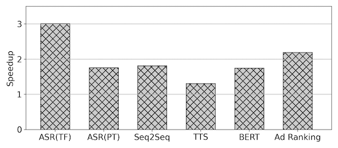

# BladeDISC Introduction <!-- omit in toc -->

## We're hiring!🔥🔥🔥
We're always looking for candicates to join dev team. Your're the one we're searching for long:
* 🥷 If you are an compiler or AI enthusiasts.
* ⭐️ or if you are experienced in optimization on CPUs and GPUs.
* ⚙️ or if you wanna build an unified and automated compiler to optimize both inference and training workload.
* 🤿 or if you are using BladeDISC in production or research projects, and wanna have a deeper dive into it.
* ✄ or you wanna build cutting-edge infrastructure in the AIGC era.

Please contact us via email or Dingtalk at the bottom of page.⬇️⬇️⬇️

- [What's New](#whats-new)
- [Overview](#overview)
  - [Features and Roadmap](#features-and-roadmap)
    - [Frontend Framework Support Matrix](#frontend-framework-support-matrix)
    - [Backend Support Matrix](#backend-support-matrix)
    - [Deployment Solutions](#deployment-solutions)
  - [Numbers of Typical Workloads](#numbers-of-typical-workloads)
    - [Advantage in Dynamic Shape Workloads](#advantage-in-dynamic-shape-workloads)
- [API QuickView](#api-quickview)
  - [For TensorFlow Users](#for-tensorflow-users)
  - [For PyTorch Users](#for-pytorch-users)
- [Setup and Examples](#setup-and-examples)
- [Publications](#publications)
- [Tutorials and Documents for Developers](#tutorials-and-documents-for-developers)
- [Presentations and Talks](#presentations-and-talks)
- [How to Contribute](#how-to-contribute)
- [Building Status](#building-status)
- [FAQ](#faq)
  - [Roadmap with mlir-hlo Project](#roadmap-with-mlir-hlo-project)
  - [Roadmap with Torch-MLIR Project](#roadmap-with-torch-mlir-project)
- [Contact Us](#contact-us)

## What's New

+ [🔥 2023.03.17] BladeDISC v0.4.0: [Massive performance and feature updates](https://github.com/alibaba/BladeDISC/releases/tag/v0.4.0)
+ [2022.12.08] BladeDISC v0.3.0:
 [Announce PyTorch 2.0 Compilation Support](https://github.com/alibaba/BladeDISC/releases/tag/v0.3.0)

## Overview

BladeDISC is an end-to-end **DynamIc Shape Compiler** project for machine
learning workloads, which is one of the key components of Alibaba's
[PAI-Blade](https://www.aliyun.com/activity/bigdata/blade). BladeDISC provides
general, transparent, and ease-of-use performance optimization for
TensorFlow/PyTorch workloads on GPGPU and CPU backends. The architecture
natively supports dynamic shape workloads, with many considerations in the
performance of both static and dynamic shape scenarios. It also supports
multiple and flexible deployment solutions, including both Plugin Mode inside
TensorFlow/PyTorch runtime, and Standalone Mode for AOT standalone execution.
The project is based on [MLIR](https://mlir.llvm.org/) and highly related to
[mlir-hlo](https://github.com/tensorflow/mlir-hlo) project.

Refer to [our website](https://alibaba.github.io/BladeDISC/) for more
information, including the setup tutorial, developer guide, demo examples and
documents for developers.

### Features and Roadmap

#### Frontend Framework Support Matrix

|           | TensorFlow [1] | PyTorch [2]  |
|---------- | -------------- | ------------ |
| Inference |    Yes         |    Yes       |
|  Training |    Yes [3]     |  Ongoing     |

[1] TensorFlow 1.12, 1.15, 2.4 & 2.5 are supported and fully verified. For other
versions, some slight work on adaptation might be needed.

[2] PyTorch version >= 1.6.0 has been fully verified.

[3] Although supported, there's much room for improvement on Op coverage for
training workloads.

#### Backend Support Matrix

|            |   Status      |
|----------- | ------------- |
| Nvidia GPU |    Yes [1]    |
| AMD GPU    |    Yes        |
| Hygon DCU  |    Yes        |
|  X86       |    Yes        |
| AArch64    |    Yes        |

[1] Support for CUDA below 11.0 has been deprecated officially since Aug 2022.

#### Deployment Solutions

* Plugin Mode - BladeDISC works as a plugin of TensorFlow or PyTorch. Only the
  supported Ops are clustered and compiled, and the unsupported ones will be
  executed by the original TensorFlow or PyTorch runtime. We recommend this mode
  to most of the users for its transparency and ease of use.

* Standalone Mode - In Standalone mode, the input workload will be compiled into
  a binary that can be executed by itself, aka, does not rely on a TensorFlow
  or PyTorch runtime. In this mode, all ops must be supported.

### Numbers of Typical Workloads

By evaluating BladeDISC using a set of typical machine learning workloads for
production purposes, BladeDISC shows up to 6.95x speedup compared with
PyTorch. Moreover, compared to static optimizing compilers (i.e.,
XLA and TensorRT), BladeDISC shows comparable or even better performance.

<figure align="center">

<figcaption align = "center">
<b>
Fig.1 End-to-end Performance of BladeDISC and baselines.
Note that some baselines fail to optimize ViT model.
</b>
</figcaption>
</figure>

#### Advantage in Dynamic Shape Workloads

Specifically, for the BERT large inference on T4 GPU, we provide in the
[examples](./docs/tutorials/tensorflow_inference_and_training.md), static compiler
optimization (XLA) shows severe performance degradation due to its compilation
overhead, while BladeDISC shows a 1.75x speedup.

| TensorFlow  |    XLA    |  BladeDISC  |
|-------------|-----------|-------------|
|   1.78 s    |   41.69s  |    1.02s    |
|   1X        |           |    1.75X    |

## API QuickView

### For TensorFlow Users

Only two lines of code are needed on native TensorFlow program as the following:

``` python
import numpy as np
import tensorflow as tf

## enable BladeDISC on TensorFlow program
import blade_disc_tf as disc
disc.enable()

## construct TensorFlow Graph and run it
g = tf.Graph()
with g.as_default():
    ...
    with tf.session as sess:
        sess.run(...)
```

For more information, please refer to [QuickStart for TensorFlow
Users](./docs/quickstart.md#quickstart-for-tensorflow-users)

### For PyTorch Users

PyTorch users only need the following few lines of code to enable
BladeDISC:

``` python
import torch_blade
# construct PyTorch Module
class MyModule(nn.Module):
    ...

module = MyModule().eval()

with torch.no_grad():
    # blade_module is the optimized module by BladeDISC
    blade_module = torch_blade.optimize(module, allow_tracing=True, model_inputs=(x, y))

# run the optimized module
blade_module(x, y)
```

`torch_blade.optimize` accepts an `nn.Module` object and outputs the
optimized module.  For more information, please refer to [Quickstart
for PyTorch Users](./docs/quickstart.md#quickstart-for-pytorch-users).

## Setup and Examples

* [How to Setup and Build from Source](./docs/build_from_source.md)
* [Use Case of TensorFlow Inference and Training](./docs/tutorials/tensorflow_inference_and_training.md)
* [Use Case of PyTorch Inference](./docs/tutorials/torch_bert_inference.md)

## Publications

* Zhen Zheng, Zaifeng Pan, Dalin Wang, Kai Zhu, Wenyi Zhao, Tianyou Guo, Xiafei Qiu, Minmin Sun, Junjie Bai, Feng Zhang, Xiaoyong Du, Jidong Zhai, Wei Lin.
BladeDISC: Optimizing Dynamic Shape Machine Learning Workloads via Compiler Approach. (SIGMOD'24)

* Zhen Zheng, Xuanda Yang, Pengzhan Zhao, Guoping Long, Kai Zhu, Feiwen Zhu, Wenyi Zhao, Xiaoyong Liu, Jun Yang, Jidong Zhai, Shuaiwen Leon Song, Wei Lin. 
[AStitch: Enabling a New Multi-dimensional Optimization Space for Memory-Intensive ML Training and Inference on Modern SIMT Architectures](./docs/papers/asplos-22-zhenzheng.pdf). (ASPLOS'22)


## Tutorials and Documents for Developers

* [Tutorial: A Walkthrough of the BladeDISC Pass Pipeline](./docs/developers/pass_pipeline.md)
* [Introduction to Runtime Abstraction Layer](./docs/developers/runtime_abstraction_layer.md)
* [TorchBlade Overview](./docs/developers/bladedisc_torch_overview.md)
* [Tutorial: How to Add a New Torch Operator](./docs/developers/torch_add_a_new_operator.md)

## Presentations and Talks
* [Performance optimization practice for dynamic shape AI workloads via a compiler-based approach](https://bladedisc.oss-cn-hangzhou.aliyuncs.com/docs/performance-optimization-practice.pdf)
* [2022/07/31 BladeDISC: A Practice of Dynamic Shape Deep Learning Compiler(Chinese)](https://bladedisc.oss-cn-hangzhou.aliyuncs.com/docs/BladeDISC%EF%BC%9A%E5%8A%A8%E6%80%81Shape%E6%B7%B1%E5%BA%A6%E5%AD%A6%E4%B9%A0%E7%BC%96%E8%AF%91%E5%99%A8%E5%AE%9E%E8%B7%B5%E7%9A%84.pdf)
* [2022/07/07 BladeDISC and Torch-MLIR Roadmap Talk on Torch-MLIR Community](https://bladedisc.oss-cn-hangzhou.aliyuncs.com/docs/BladeDISC-and-TorchMLIR-Roadmap-tts.pptx)
* [GTC22-S41073, Generalized and Transparent AI Optimization Solutions with AI Compilers from Cloud Service](https://bladedisc.oss-cn-hangzhou.aliyuncs.com/docs/GTC22%20S41073%2C%20Generalized%20and%20Transparent%20AI%20Optimization%20Solutions%20with%20AI%20Compilers%20from%20Cloud%20Service.pdf)
* [GTC22-S41395, Easier-to-use and More Robust TensorRT via PAI-Blade](https://bladedisc.oss-cn-hangzhou.aliyuncs.com/docs/GTC22-S41395%2C%20Easier-to-use%20and%20More%20Robust%20TensorRT%20via%20PAI-Blade.pdf)
* [2023/2/17 bladedisc intro. (cpu vendor oriented)](https://bladedisc.oss-cn-hangzhou.aliyuncs.com/docs/bladedisc-intro-for-intel.pdf)
* [2023/3/10 transform dialect based codegen in bladedisc](https://bladedisc.oss-cn-hangzhou.aliyuncs.com/docs/transform-dialect-based-codegen-in-bladedisc.pdf)

## How to Contribute

* [Contribute to BladeDISC](./docs/contribution.md)

## Building Status

| Framework | Device| Status |
| -- | -- | -- |
| PyTorch Pre | GPU | [](https://github.com/alibaba/BladeDISC/actions/workflows/pytorch_pre_gpu.yml) |
| PyTorch Pre | CPU | [](https://github.com/alibaba/BladeDISC/actions/workflows/pytorch_pre_cpu.yml) |
| PyTorch2.0.0 | GPU | [](https://github.com/alibaba/BladeDISC/actions/workflows/pytorch200_gpu.yml) |
| PyTorch2.0.0 | CPU | [](https://github.com/alibaba/BladeDISC/actions/workflows/pytorch200_cpu.yml) |
| PyTorch2.0.0 | Yitian | [](https://github.com/alibaba/BladeDISC/actions/workflows/pytorch200_yitian.yml) |
| PyTorch1.13.0 | GPU | [](https://github.com/alibaba/BladeDISC/actions/workflows/pytorch113_gpu.yml) |
| PyTorch1.13.0 | CPU | [](https://github.com/alibaba/BladeDISC/actions/workflows/pytorch113_cpu.yml) |
| PyTorch1.13.0 | Yitian | [](https://github.com/alibaba/BladeDISC/actions/workflows/pytorch113_yitian.yml) |
| TensorFlow2.5 | GPU | [](https://github.com/alibaba/BladeDISC/actions/workflows/tf250_gpu.yml) |
| TensorFlow2.5 | CPU | [](https://github.com/alibaba/BladeDISC/actions/workflows/tf250_cpu.yml) |
| TensorFlow2.8 | Yitian | [](https://github.com/alibaba/BladeDISC/actions/workflows/tf280_yitian.yml) |

## FAQ

### Roadmap with mlir-hlo Project

BladeDISC is in a close relationship with
[mlir-hlo](https://github.com/tensorflow/mlir-hlo) project. Part of the building
blocks, including the MHLO Op definitions, TF to MHLO conversions, and some
general purpose passes have been upstreamed to mlir-hlo repository. We'll
continue to work in a close cooperative relationship with mlir-hlo project in
the longer term.

### Roadmap with Torch-MLIR Project

BladeDISC compiles PyTorch workloads based on [Torch-MLIR](https://github.com/llvm/torch-mlir/).
The BladeDISC Dev Team is cooperating with the community to add Torch-To-Mhlo conversion
to Torch-MLIR, especially fully dynamic shape features.
See RFC: https://github.com/llvm/torch-mlir/issues/999.
We appeal to the community developers interested in joining.

## Contact Us

* Mailgroup: bladedisc-dev@list.alibaba-inc.com

* DingTalk group for support and discussion:


