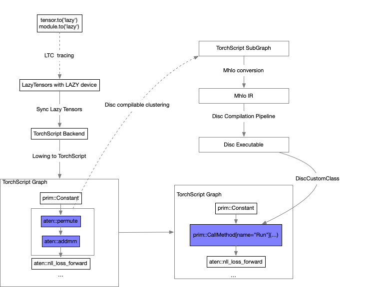

# Design Doc: Accelerate PyTorch training via BladeDISC and PyTorch Lazy Tensor Core

BladeDISC is an end-to-end compiler that accelerates AI workload based on MLIR.
PyTorch [Lazy Tensor Core (LTC)](https://github.com/pytorch/pytorch/blob/lazy_tensor_staging/lazy_tensor_core/README.md)
provides a infrastructure to connect to PyTorch to deep learning accelerators
especial on training.  This design document aims to introduce how to extend
PyTorch LTC to accelerate PyTorch training via BladeDISC.

## Overview

In PyTorch LTC world, TorchScript backend lowing Lazy Tensors into TorchScript
and execute it with `torch::jit:GraphExecutor`.  To a new vender backend, LTC
suggests implement `BackendImplInterface` and serval coordinates pieces, ref:
[adding vender backend](https://github.com/pytorch/pytorch/tree/lazy_tensor_staging/lazy_tensor_core#adding-vendor-backends).
But to BladeDISC, optimizing a sub-graph achieves higher
[ROI](https://en.wikipedia.org/wiki/Return_on_investment), we can refuse most
TorchScript symbols and runtime mechanism, so a better way is to extend
TorchScript Backend(TSBackend in LTC) which only optimize a sub-graph of the
whole TorchScript graph.



The above illustration shows the key process:

1. traverse the whole graph and cluster the Disc compilable nodes into a
   sub-graph.
1. convert TorchScript IR into mhlo IR.
1. call the Disc compiling pipeline into an executable program.
1. implement Disc `CustomClassHolder` to bind the executable program above.
1. replace the disc cluster sub-graph on the origin graph with
`prim::CallMethod` symbol to call Disc executable at runtime.

## Implementation

### Extend LTC TorchScript Backend

After reading PyTorch LTC source code, `BackendImplInterface` provides some
important interface:

- `[]ComputationPtr Compile(ComputationPtr[])`, takes a Computation object and
  returns a compiled graph, `Computation` object contains TorchScript runtime
  instance and some coordinates pieces.
- `BackendDataPtr ExecuteComputation(Computation, BackendDataPtr[], BackendDevice)`,
  execute the TorchScript runtime with input Tensors and return
  the result Tensors.

Disc compiler requires input Tensors contain `rank` and `dtype ` meta
information, so we should do some shape inference with the input Tensors before
calling the Disc compilation pipeline, that we decide to override
`ExecuteComputation` as the following rough pseudocode:

``` cpp
DISCBackendImpl::ExecuteComputation(...) {
  auto graph_hash = HashData(graph);
  if (cache->find(graph_hash)) {
    return graph->get(graph_hash)->executable->Run(inputs);
  }

  ExecutablePtr executable =
        CompileToDiscExecutable(graph, inputs);
  auto result = executable->Run(inputs);
  cache->Add(graph_hash, executable);
  return results;
}
```

`CompileToDiscExecutable` takes a TorchScript graph and return the executable
program with many pass functions:

``` c++
ExecutablePtr CompileToDiscExecutable(std::shared<graph> graph) {
  ...
  ClusterDiscNodesPass(graph);
  torch::jit::EliminateDeadCode(graph);
  ...
  RegisterDiscClassPass(graph);
  torch::jit::EliminateDeadCode(graph);
  return std::make_shared<Executable>(graph);
}
```

### Cluster Disc Compilable Nodes

`ClusterDiscNodesPass` cluster Disc compilable nodes into a `SubGraph`, given an
original TorchScript graph snippet as the following:

``` cpp
graph(...):
  %4 : int[] = prim::Constant[value=[2, 3]]()
  %5 : Float(*, *, requires_grad=0, device=cpu) = aten::reshape(%p2, %4)
  %6 : Float(*, *, device=cpu) = aten::add(%5, %p1, %p0)
  return (%6)
```

`aten::reshape` and `aten::add` operators are connected and they are all Disc
compilable nodes, so we can cluster them into a Disc node, which is a
`FusionGroup`:

``` cpp
graph(...):
  %4 : int[] = prim::Constant[value=[2, 3]]()
  %6 : Float(*, *, device=cpu) = prim::FusionGroup_0(%p2, %p1, %4)
  return (%6)
with prim::FusionGroup_0 = graph(...):
  %5 : Float(*, *, requires_grad=0, device=cpu) = aten::reshape(%p2_, %p3_)
  %6 : Float(*, *, device=cpu) = aten::add(%5, %p1_, %p0_)
  return (%6)
```

### Bind Disc CustomClassHolder

[BladeDISC RAL](../developers/runtime_abstraction_layer.md) is designed to unify
difference runtime backend (TensorFlow, PyTorch or even standalone binary). To
Execute the Disc executable program at TorchScript runtime, we will implement a
`DiscClass` which is derived from `torch::CustomClassHolder` to bind RAL. For
more details about how, please go to the PyTorch official website.

Before that, we should compile each `prim::FusionGroup` as the above section to
Disc executable program via `disc_compiler_main` binary. The `DiscClass` class
is just like:

``` cpp
class DiscClass : public torch::CustomClassHolder {
 public:
  // bind input Pytorch Tensor into context
  void BindingInputs(
      const torch::List<torch::Tensor>& inputs,
      tao::ral::ExecutionContext& exec_ctx) const;
  // bind output into execution context
  torch::List<torch::Tensor> CreateAndBindingOutputs(
      tao::ral::ExecutionContext& exec_ctx) const;
  // 
  torch::List<torch::Tensor> Run(const torch::List<torch::Tensor>& inputs);
 private:
  std::unique_ptr<tao::ral::BaseContext> ral_ctx_;
}
```

Finally, we should rewrite the graph, add `DiscClass` as the Graph input, and
replace `prim::FusionGraph` with `prim::CallMethod` symbol to bind DiscClass:

``` cpp
graph(...
      disc_class_p0:  __torch__.torch.classes.torch_disc.DiscClass):
  %4 : int[] = prim::Constant[value=[2, 3]]()
  %10 : Tensor[] = prim::ListConstruct(%p2, %p1, %4)
  %11 : Tensor[] = prim::CallMethod[name="Run"](%disc_class_p0, %10)
  %13 : Float(*, *, device=cpu) = prim::ListUnpack(%11)
  return (%13)
```
