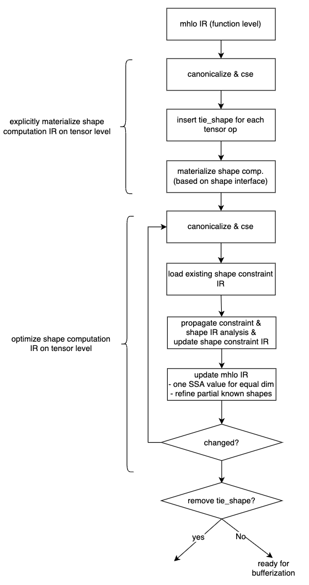

# Background

Dynamic shape problem is ubiquitous when deploying AI workloads. Almost all our in-house models have dynamic shape problem in some degree. Dynamic shape problem can be divided into two categories.

- Input shape of the model is dynamic
  - different batch size in inference scenarios
  - different image size, sequence length, etc
- Shape is dynamic by design
  - For seq2seq model, the number of decoding step is dynamic
  - For CV detection model, the number of detected instants is dynamic
  - For recommendation model, shape is affected by the value of its inputs (e.g. `tf.UniqueOp`).

To solve the above problem, BladeDISC, an e2e dynamic shape compiler, is proposed. We already have seen many advantages of using BladeDISC over the previous static-shape-based compiler (e.g. XLA) in many pratical scenarios. However, there are still many rooms for improvement, especially in terms of the performance. In dynamic shape semantics, the concrete shape is out of reach, making many optimization strategies used in static shape semantics invalid. According to our previous experience in optimizing dynamic shape AI workloads, we found that shape constraint, the relationship between different symbolic shape (or dimension size), is very helpful in terms of performance optimization. For example:

- (partial) shape inference, propagating some known information to make best use of the existing information.
e.g. `mhlo.add(tensor<?x10xf32>, tensor<10x?xf32>) -> tensor<?x?xf32>` can be simplifier to `mhlo.add(tensor<10x10xf32>, tensor<10x10xf32>) -> tensor<10x10xf32>`.
- graph optimization. For example, removing redundant `mhlo.dynamic_broadcast_in_dim` op if we can infer that the output and input of the broadcast op have the same shape.
- layout optimization. For example, grouping shape-compatible ops, using same layout inside the group, saving redundant layout conversion between ops inside the groups.
- Fusion decision. Making use of the shape constraint information, we can do better fusion decision in dynamic shape semantics, e.g., only fusing shape-compatible ops into one kernel.
- Codegen optimization. For example, removing many redundant index calculation if we know some symbolic dimensions have the same size, which is crucial when the fusion pattern is relative large.
- and many others ...

In this design document, we will first give a brief introduction to the definition of the shape constraint we used in the document and where we can get the shape constraint information. Then, we will show the limitations of the current strategy of making use of the shape constraint information and why we need to use shape constraint IR. At last, we will describe the details of shape constraint IR design and the related optimizations.

# What is shape constraint?

There are two kinds of shape constraint:

- Structure shape constraint, the predicate (relationship) between different symbolic dimensions.
  - dimension size equality
    - the size of one dimension of a tensor is equal to the size of one dimension of another tensor.
    - the size of one dimension of a tensor is equal to the size of another dimension of the same tensor.
  - equality of the number of elements
    - the number of elements of a tensor is equal to the number of elements of another tensor.
  - group multiplication equality
    - e.g. `reshape([a, b, c, d]) -> [ab, cd]`
  - and many others ...
- Shape distribution constraint
  - `dim size % 4 = 0`;
  - Likely values of the symbolic dimension (shape);
  - Possible shape ranges of the symbolic dimension (shape);
  - and many others ...

# Where to get shape constraint?

## Semantics of the definition of operation

- The inputs and outputs of an elementwise op of mhlo dialect should have same shape
- The input and output of a mhlo.dynamic_reshape op should have same number of elements
- The inputs and output of a mhlo.concat op should have same dim size for each non-concat dim
- and many others ...

An example for mhlo binary is shown as following. Note that the `SameOperandsAndResultShape` trait
used in the op definition.
```
class HLO_BinaryElementwiseOpNoAssembly<string mnemonic, list<Trait> traits> :
    HLO_Op<mnemonic, traits # [InferShapedTypeOpInterface,
    SameOperandsAndResultShape, Elementwise]> {
  let arguments = (ins
    HLO_Tensor:$lhs,
    HLO_Tensor:$rhs
  );

  let extraClassDeclaration = [{
    ...
  }];

  let results = (outs HLO_Tensor:$result);
}
```

## Injected by frontend converter

BladeDISC frontend converter lowers a coarse grained op to a bunch of fine grained MHLO ops. Not only the data computation but also the shape constraint should be lowered during dialect conversions.
For example, `tf.SplitOp` will be lowered into a series of `mho.RealDynamicSliceOp`. According to the definition of the `tf.SplitOp`, we can know that all the outputs of the split op should have same shape and `the split dimension of the input % (number of outputs) == 0`.


In the current implementation, we only do data computation IR lowering, losing some shape constraint information, which in turn leads to losing some opportunities to do further optimizations.

## Symbolic Shape Analysis

There are two kinds of symbolic shape analysis ways.

- Propagation existing shape constraint to find more shape constraint
  - Input -> output, input -> input, output -> input
- Shape computation IR analysis
  - As shown in the below example, we can know more about the dynamic reshape op by analyzing the shape computation IR (to be concrete, the IR used to calculate the target shape of the `dynamic_reshape` op).


## Injected at JIT compilation time

The input shapes are actually known at JIT compilation time. We may choose to inject such information as likely shape values of the inputs of the graph and then propagate such information.

## Provided by end users

User may provide more information about the distribution of the shape of inputs (e.g. shape range) or relationships of the shape of inputs (e.g. two inputs have same shape). And then, the compiler can make use of such information to do better optimizations.

# Why shape constraint IR?

Although we have already made use of the shape constraint in some degree, there are still many limitations of the current implementation. In the current implementation, The shape constraint information itself is not stored using IR and we obtains the shape constraint information by doing global analysis on the data computation IR each time we need it. The above design choice leads to following problems:

- shape constraint information loss during dialect conversion. During the whole optimization pipeline, the data computation IR is lowered many times (e.g. tf/torch dialect -> mhlo, mhlo -> lmhlo). For each lowering, we only do data computation IR lowering currently, losing some shape constraint information.
the result of shape constraint analysis is not stable after IR mutation (e.g. after running canonicalization pass). Such inconsistent result may lead to wired behaviour when making use of shape constraint information across passes.
- doing analysis on the data computation IR globally to get shape constraint information is more challenging or even impossible after lowering to buffer level (e.g. lmhlo dialect). It's very hard to do analysis by chasing a series of load/store ops, especially when there exists control flow ops.
- shape distribution constraint can not always be analyzed from the data computation IR. And we do not have a unify way to describe such information across different dialects.

To solve the above problem, we propose using shape constraint IR to describe shape constraint information explicitly. We'll give more details about the design in following sections.

# Shape constraint IR design

## Basic idea

- using type instead of dedicated shape constraint op to encode shape constraint information into data computation IR.
  - Type-based schema not introduce any other ops, which means most of the existing pattern-based passes (e.g. `matmul+BiadAdd -> FusedMatmulBiasAdd`) not do need to take shape constraint ops into consideration.

```
// type-based encoding schema
// each unique reference attribute (e.g. @S0, @S1) represents a unique symbolic dim.
%2 = mhlo.add(%0, %1) : (tensor<?x?xf32, [@S0, @S1]>, tensor<?x?xf32, [@S0, @S1]>) -> tensor<?x?xf32, [@S0, @S1]>

// op-based encoding schema
%d0 = tensor.dim %0, %c0 : tensor<?x?xf32>
%d1 = tensor.dim %0, %c1 : tensor<?x?xf32>
// explicitly binding each dimension size with the corresponding tensor
%n0 = disc_shape.tie_shape(%0, %d0, %d1) : tensor<?x?xf32>
%n1 =  disc_shape.tie_shape(%1, %d0, %d1) : tensor<?x?xf32>
%2 = mhlo.add(%n1, %n2) : (tensor<?x?xf32>, tensor<?x?xf32>) -> tensor<?x?xf32>
%n2 =  disc_shape.tie_shape(%2, %d0, %d1) : tensor<?x?xf32>
```

- Separating shape constraint IR and data computation IR.
  - Some shape constraint information (e.g. shape distribution constraint) is not always possible to be bound with data computation IR.
  - A unified way to describe shape constraint information, no matter what dialects the data computation IR used. And thus, the shape constraint information will no longer be lost when lowering data computation IR during the whole optimization pipeline.

```
func @main() {
  ...
  %0 = any_dialect.any_operation(...) : tensor<?x?xf32, [@S0, @S1]>
  ...
}

disc_shape.SymbolDim @S0 {
  range list : [[...], [...], ...]
  likely_values : [...]
  ...
  symbolic_shape_graph: @shape_constraint_graph
}

disc_shape.SymbolDim @S1 {
  range list : [[...], [...], ...]
  likely_values : [...]
  ...
  symbolic_shape_graph: @shape_constraint_graph
}

// A separated function to store shape constraint predicates between different symbolic dimensions.
// Each symbolic dim is either bound to a `disc_shape.dim` op or `disc_shape.bind_dim`
func @shape_constraint_graph(...) {
  %0 = disc_shape.dim() {ref: @S0} : index
  %1 = disc_shape.dim() {ref: @S1} : index
  disc_shape.tie_predicate_divisible(d0, d1) // d0 % d1 == 0

  // other tie_* ops
  //   disc_shape.tie_predicate_eq(d0, d1)  // d0 == d1
  //   disc_shape.tie_predicate_lt(d0, d1)  // dim less than
  //   disc_shape.tie_predicate_mul_eq(d0, d1, d2, ...) // d0 = d1 * d2 * ...
  //   // d0 * d1 = s0 * s1
  //   disc_shape.tie_predicate_group_mul_eq([d0, d1, ..], [s0, s1, ...])
  //   // d0 = affine.apply(d1, d2, ...) {affine_attr = ...}
  //   disc_shape.tie_predicate_affine_eq(d0, d1, d2, ...) {affine_attr = ...}
}
```

- explicitly materialize all shape computation IR on tensor level instead of on buffer level. Currently, we only materialize all shape computation IR after bufferization (mhlo -> lmhlo). It means we have to do some shape computation IR analysis and optimization on buffer level, which could be much difficult than doing same thing on tensor level since we have to chasing each load/store ops and buffer alias to do analysis.

## Basic flow

Most logic is implemented inside the shape optimization pass which is shown as following diagram.
The shape optimization pass is tensor-level only pass, and is reenterable. The whole pass can be divided into two stages.

- stage one: explicitly materialize shape computation IR on tensor level.
- stage two: shape constraint analysis and shape computation IR optimization on tensor level.



### stage one: explicitly materialize shape computation IR on tensor level

It's main functions:

- (partial) shape inference, (input -> output only in the phase)
  - no need to do shape inference manually anymore.
  - taking advantage of existing canonicalize pattern & cse pass
  - example:
    - `concat([tensor<?x10xf32>, tensor<?x10xf32>], axis=1) -> tensor<?x20xf32>`
- enable more opportunities to optimize shape computation IR
  - again, taking advantage of existing canonicalize pattern & cse pass
  - examples:

```
 // An unified solution to handle partial known shape information
 - mhlo.real_dynamic_slice:
    - %out = %in[:,1:]
 - mhlo.dynamic_conv
    - if stride = 1, padding = kernel size, then output spatial size == input spatial size
 - dynamic pad
    - if only padding along some of the axes,
    - then output and input have some size along the other axes
 - ...

 // take `mhlo.real_dynamicm_slice:  %out = %in[:,1:]` as an example
 %d0 = %tensor.dim %in, %c0 : tensor<?x?xf32>
 %d1 = %tensor.dim %in, %c1 : tensor<?x?xf32>
 %begin = tensor.from_elements %c0, %c1 : tensor<2xindex>
 %end = tensor.from_elements %d0, %d1 : tensor<2xindex>
 %strides = tensor.from_elements %c1, %c1 : tensor<2xindex>
 %out = mhlo.real_dynamic_slice(%in, %begin, %end, %strides)

 // we only need to provide a `tensor.extract_elements + tensor.from_elements`
 // rewrite pattern, and then we can know that the output and input have same
 // dim size along the first axis by taking advantage of existing
 // `canonicalize pattern & cse pass`
```

It's basic flow:

- For a given data computation function (e.g. the main function), we insert a `disc_shape.tie_shape` for each value having `RankedTensorType` type. An example is shown as below.

```
// before inserting tie_shape op
func @main(%arg0 : tensor<?xf32>) -> tensor<?xf32> {
  %0 = "mhlo.some_ops"(%arg0) : tensor<?xf32>
  return %0 : tensor<?xf32>
}

// after inserting tie_shape op
func @main(%arg0 : tensor<?xf32>) -> tensor<?xf32> {
  %c0 = constant 0 : index
  // insert tie_shape op for %arg0
  %d0_arg0 = tensor.dim %arg0, %c0 : tensor<?xf32>
  %new_arg0 = disc_shape.tie_shape(%arg0, %d0_arg0)

  %result = "mhlo.some_ops"(%new_arg0) : tensor<?xf32>

  // insert tie_shape op for %result
  %d0_result = tensor.dim %result, %c0 : tensor<?xf32>
  %new_result = disc_shape.tie_shape(%result, %d0_result)
  return %new_result : tensor<?xf32>
}
recursively resolve tensor.dim/shape.shape_of op based on shape interface implementation. basic idea is shown as below.
// take `tensor.dim` as an example, same to shape.shape_of

for each tensor.dim op:
  operand = dimOp.getOperand(0)
  definingOp = operand.getDefiningOp()
  if (definingOp has shape interface implementation)
    materialize the shape interface implementation

// reference implementation pass:
// mlir/lib/Dialect/MemRef/Transforms/ResolveShapedTypeResultDims.cpp
```

### stage two: shape constraint analysis and shape computation IR optimization on tensor level

It’s an iterative process and the whole process can be divided into five steps:

1. canonicalization stage
   - including normal canonicalization pattern & CSE
   - and a bunch of new rewrite patterns
     - Scalarize shape computation IR whenever possible
       - shape.shape_of -> a bunch of tensor.dim ops
       - shape.broadcast(shape_a, shape_b) -> dim-wise broadcast + tensor.from_elements
     - bcast/reshape simplifier
     - ...
1. load existing shape constraint IR
1. global shape analysis
   - analysis shape computation IR -> find more constraint
   - inject shape constraint implied by mhlo op definition
   - ...
1. global shape optimization
   - using same SSA value for symbolic equal dims
   - refine types with partial known information globally
1. save the updated shape constraint information into IR
