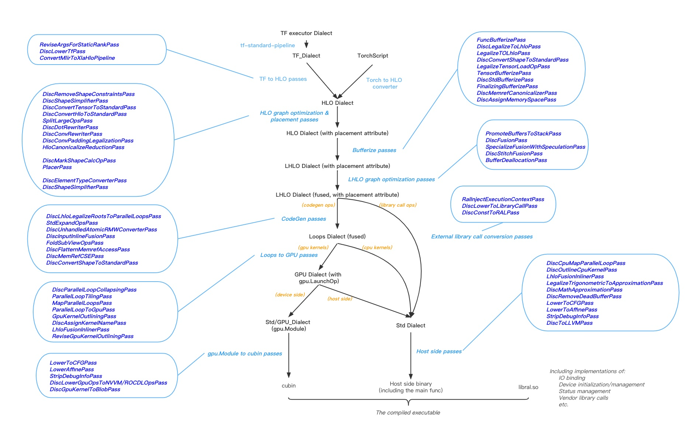
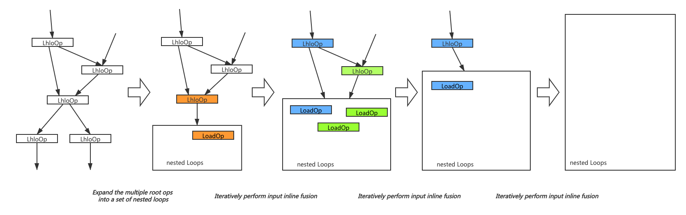

# A Walkthough of the BladeDISC Pass Pipeline

* [Abstract](#abstract)
* [Pass Pipeline Walkthrough](#pass-pipeline-walkthrough)
  + [TF-to-HLO Passes](#tf-to-hlo-passes)
  + [HLO graph optimzation & placement passes](#hlo-graph-optimzation---placement-passes)
    - [ShapeSimplifier pass](#shapesimplifier-pass)
    - [Placement Passes](#placement-passes)
    - [Graph Optimization Passes on Tensor Level](#graph-optimization-passes-on-tensor-level)
    - [Misc Conversion Passes that Prepare for Further Lowering](#misc-conversion-passes-that-prepare-for-further-lowering)
  + [Bufferize Passes](#bufferize-passes)
    - [HLO to LMHLO conversion](#hlo-to-lmhlo-conversion)
    - [Shape Related Ops Bufferization](#shape-related-ops-bufferization)
    - [Memory Space Assignment](#memory-space-assignment)
  + [LHLO Graph Optimization Passes](#lhlo-graph-optimization-passes)
    - [Fusion Pass](#fusion-pass)
    - [Speculation Pass](#speculation-pass)
    - [Memory Optimization Passes](#memory-optimization-passes)
  + [Runtime & Library Call Related Passes](#runtime---library-call-related-passes)
  + [CodeGen Passes](#codegen-passes)
    - [Backbone CodeGen Passes](#backbone-codegen-passes)
    - [Other Miscellaneous Purposed Passes](#other-miscellaneous-purposed-passes)
  + [Loops to GPU Passes](#loops-to-gpu-passes)
  + [GPU Module to CUBIN](#gpu-module-to-cubin)
    - [Lowering structure control flow ops](#lowering-structure-control-flow-ops)
    - [Lowering GPU Dialect ops to specific gpu vendor ops](#lowering-gpu-dialect-ops-to-specific-gpu-vendor-ops)
    - [Compile to GPU binary code](#compile-to-gpu-binary-code)
  + [Host Side Passes](#host-side-passes)
    - [Lowering Structure Control Flow Ops](#lowering-structure-control-flow-ops)
    - [Lowering to LLVM Dialect](#lowering-to-llvm-dialect)

## Abstract

This tutorial will give a brief introduction for the compiler part of BladeDISC
by walking through the backbone pass pipeline, hoping the readers can quickly
build some intuitive understanding of the overall framework. We choose a small
piece of TensorFlow subgraph as a sample that contains the major factors to be
considered in the design, and will show you the brief lowering process and
what does each backbone pass do to the IRs.

The binary tools for the demo provided in this document are for a CUDA 10.0
environment. It's also recommended to use [jupyter
notebook](https://jupyter.org/index.html) together with
[jupytext](https://jupytext.readthedocs.io/en/latest/install.html) to run the
tutorials in this document. Please refer to
[build_from_source.md](../build_from_source.md)
to build the binaries if you are in other CUDA environments.


<center>PassPipeline of DISC</center>

Before we start, let's recap the major problems we need to solve for the
consideration of a dynamic shape compiler. Most of these aspects have been
talked about in [DISC : A Dynamic Shape Compiler for Machine Learning
Workloads](https://arxiv.org/pdf/2103.05288v1.pdf).

* IR definition in dynamic shape semantics

We choose HLO as the tensor level "hub" IR interfacing with different frontend
frameworks, since HLO has already been well established in the MHLO/XLA
community and quite a lot of experience can be inherited. However, HLO was
designed for static shape compiler and lacks the ability to express dynamic
shape in some cases. As a solution, we extend HLO with a set of IR
supplementation. In general, these extended operations are prefixed with
"Dynamic" (one exception is mhlo.RealDynamicSliceOp since there is already one
named with DynamicSliceOp). These extended part has already been upstreamed into
[Mlir-HLO](https://github.com/tensorflow/mlir-hlo).


Here we demo the difference in op definition with SliceOp as an example:

mhlo.SliceOp:

```
def HLO_SliceOp: HLO_Op<
      "slice",
      [Pure, SameOperandsAndResultElementType,
       AllTypesMatch<["start_indices", "limit_indices", "strides"]>,
       DeclareOpInterfaceMethods<InferTypeOpInterface>]> {
  let arguments = (ins
    HLO_Tensor:$operand,
    I64ElementsAttr:$start_indices,
    I64ElementsAttr:$limit_indices,
    I64ElementsAttr:$strides
  );

  let results = (outs HLO_Tensor);

  let hasCanonicalizer = 1;
  let hasFolder = 1;
}
```

mhlo.RealDynamicSliceOp:

```
def HLO_RealDynamicSliceOp: HLO_ShapedInterfaceOp<
      "real_dynamic_slice",
      [Pure, AllElementTypesMatch<["operand", "result"]>,
       AllTypesMatch<["start_indices", "limit_indices", "strides"]>]> {
  let summary = "Real Dynamic Slice operator";
  let description = [{
    The dynamic shape version of SliceOp extracts a sub-array from the input
    array according to start_indices, limit_indices, and strides, expecting
    start_indices/limit_indices/strides to be statically shaped and matching
    the rank of the input.
  }];
  let arguments = (ins
    HLO_Tensor:$operand,
    HLO_DimensionTensor:$start_indices,
    HLO_DimensionTensor:$limit_indices,
    HLO_DimensionTensor:$strides
  );
  let results = (outs HLO_Tensor:$result);
  let hasCanonicalizer = 1;
  let hasCustomHLOConverter = 1;
}
```

As you may have noticed, the major difference is that, in the static shape
version the start/limit/strides are attributes, which means that the subgraph
that produce them must be constant folded at compile time given each set of
input shapes. While, for the dynamic shape version, these are regular inputs,
which means the IR is able to express a frontend compute graph in dynamic shape
semantics.

* Shape calculation, placer, buffer management, and runtime support

One challenge of dynamic shape compiler is that, compiling is a static action,
while we aim to handle dynamic behavior. In order to fully support dynamic
shapes, the compiler must be able to do adaptive shape inference and generate
code not only for data calculation, but also for shape calculation. The
calculated shapes of each buffer will guide the buffer allocation and launch
dimension at runtime. BladeDISC does bufferization during the conversion from
mhlo to lmhlo. Rather than using an interpreter or virtual machine, BladeDISC
compiles and generates the code of computations on both host and device side,
and also the runtime flows (buffer management, kernel launch, et.al.).

Runtime Abstraction Layer (RAL) is used to isolate the complexity between the
compiler and different runtime environments, so that the compiler does not see
the difference between a PyTorch runtime and a TensorFlow runtime, also it will
not bother with the management of stateful information at runtime. Refer to
[Runtime Abstraction Layer](./runtime_abstraction_layer.md) for more information.

* Performance

The challenge of an AI compiler on performance is enlarged when the shapes are
unknown or partially unknown. For the current version, BladeDISC makes an
artificial distinction on the compute-intensive part (gemm & convolution) and
memory-intensive part (the rest calculations in general). For compute-intensive
ops, different shapes may require different optimization to achieve the best
performance. In order to balance the dynamism and performance, we implement an
interface to choose the best kernel from a library according to different
runtime shapes, and we do code generation for the memory-intensive part. The
library contains the vendor libraries such as cuBLAS/cuDNN, which can be seen as
pre-generated kernels that has been hand-tuned for each shape.

The code generation also faces the challenge of unknown shapes. A lot of regular
optimization such as data vectorization, and codegen schedule selection will be
more complicated when the sizes are unknown. For these aspects, BladeDISC will
generate multiple versions of kernels at compile time, and generate the host
side code to select a proper kernel to launch at runtime. We name this process
as "speculation" as you will see in the consequent example.

Moreover, without the concrete shape values during compilation, we lose a wide
variety of optimization opportunities, from the graph level optimization such as
algebraic simplifier to the most regular optimizations in the instruction level
like CSE. This is a common problem of the current dynamic shape related compiler
techniques. We observed that it is important to identify the shape constraints
at compile time without knowing the specific shape value. For example, a basic
kind of shape constraint is to reveal whether one dimension size of a tensor is
equal to another dimension of the same tensor or any dimension of another
tensor. In our observation, this is crucial to the overall performance.

* Multiple AI framework support & multiple backend support

Besides the TensorFlow frontend, BladeDISC supports PyTorch inference workloads
via a converter from TorchScript to mhlo. We will take a TensorFlow subgraph as
a sample and the Torch converter is out of the scope of this document, please
refer to [torch converter](./bladedisc_torch_overview.md) for more information.

Let's first get prepared with some prebuilt binaries and input IRs for this
tutorial:


```python
!wget http://pai-blade.cn-hangzhou.oss.aliyun-inc.com/bladedisc_notebook_binaries/disc_compiler_main -O disc_compiler_main

!wget http://pai-blade.cn-hangzhou.oss.aliyun-inc.com/bladedisc_notebook_binaries/tf-opt -O tf-opt

!wget http://pai-blade.cn-hangzhou.oss.aliyun-inc.com/bladedisc_notebook_binaries/disc-opt -O disc-opt

!wget http://pai-blade.cn-hangzhou.oss.aliyun-inc.com/bladedisc_notebook_binaries/tutorial.mlir -O tutorial.mlir

!chmod +x disc_compiler_main

!chmod +x tf-opt

!chmod +x disc-opt
```

We choose an input subgraph that contains as mush essential elements as
possible to demo the pass pipeline.


```python
!cat tutorial.mlir
```

## Pass Pipeline Walkthrough

### TF-to-HLO Passes


```python
!./tf-opt -tf-standard-pipeline tutorial.mlir -o tutorial_tf_dialect.mlir

!./disc-opt -disc-tf-revise-args-for-static-rank \
            -disc-lower-tf \
            tutorial_tf_dialect.mlir \
            -o tutorial_tf2hlo_snapshot_0.mlir

!./tf-opt  -tf-shape-inference \
           -xla-legalize-tf-types \
           "-xla-legalize-tf=allow-partial-conversion=true" \
           -canonicalize \
           -tf-shape-inference \
           "-xla-legalize-tf=allow-partial-conversion=false" \
           tutorial_tf2hlo_snapshot_0.mlir \
           -o tutorial_mhlo.mlir

!TF_CPP_VMODULE=disc_compiler=1 ./disc_compiler_main tutorial_mhlo.mlir result 2>pass_pipeline.log
```

The passes of this phase are mainly made of the standard tf to hlo pipeline of
mlir-hlo. In this demo, only a few passes that actually work on the sample IR
are listed. Note that for some of the TensorFlow Ops, there might be multiple
versions of lowering patterns in the LegalizeTF pass, one for static shape
semantics when the shapes are already known at compile time and the other is for
dynamic shape cases. In principle, the static shape one should be in a higher
priority for the consideration of performance.

Besides the standard tf to hlo pipeline of Mlir-HLO, and the DiscLowerTfPass
that handles the custom-call ops special for BladeDISC such as RandomUniform and
TopK, ReviseArgumentsForStaticRankPass is the only pass that needs your
attention. This is due to that BladeDISC is a dynamic shape but "static rank"
compiler considering performance & complexity. Being a static rank compiler
means that it is still possibly needed to compile more than once when the rank
of the graph is changing, though this is rarely seen in real AI workloads. Here
is the summary of the differences and similarities of a "static shape compiler"
and "static rank compiler".

|               | static shape compiler | static rank compiler |
| -------- | -------- | -------- |
| requirements  | Any factors that decide the shape should be compile time const | Any factors that decide the rank should be compile time const |
| inputs to a cluster are categorized into | (1) fixed shape inputs<br>(2) constant inputs | (1) fixed rank inputs<br>(2) fixed shape inputs<br>(3) constant inputs |
| keys to a compilation cache, or, the information must be logged during JIT clustering | shapes of (1) & values of (2) | ranks of (1) & shapes of (2) & values of (3) |

If the value or shape of some inputs to a cluster decides the rank of some
internal tensor, which is analyzed during clustering, the value or shape will be
logged into the attributes of the main func, as you can see in the IR. Here
"cluster" refers to the subgraph that the compiler can support, aka, the concept
as in the XLA codebase.

```
disc.input_shape_3 = dense<0> : tensor<2x2xi64>
```
indicates that the originally dynamic shaped %arg3 should be regarded as a known
shape of <2x2xi64> at compile time. "disc-tf-revise-args-for-static-rank" pass
is responsible to apply the logged attributes onto the IR.

After this pass, we should get the IR mainly made of Mhlo Dialect and Standard
Dialect, in which the Standard Dialect ops are for shape calculations. This is
part of the shape calculation and more will be lowered in the following phases.


```python
!cat tutorial_mhlo.mlir
```

### HLO graph optimzation & placement passes

The passes in this phase can be divided into a number of categories:

#### ShapeSimplifier pass

When insert-tie-shape is set to false, it works as a reentrant pass to propagate
some known shape information, to eliminate the unnecessary unknown dim sizes. In
a very simple example:

```
func @main(%arg0 : tensor<?xf32>, %arg1 : tensor<10xf32>) -> tensor<?xf32> {
  %0 = tensor.cast %arg1 : tensor<10xf32> to tensor<?xf32>
  %1 = "mhlo.add"(%arg0, %0) : (tensor<?xf32>, tensor<?xf32>) ->
  tensor<?xf32> return %1 : tensor<?xf32>
}
```

can be optimized into:

```
func @main(%arg0 : tensor<10xf32>, %arg1 : tensor<10xf32>) -> tensor<10xf32> {
  %1 = "mhlo.add"(%arg0, %0) : (tensor<10xf32>, tensor<10xf32>) ->
  tensor<10xf32> return %1 : tensor<10xf32>
}
```

When the insert-tie-shape is set to true, which is only allowed at the end of
this phase when it's about to do bufferization, this pass analyzes the graph and
inserts shape constraints explicitly onto the IR. On the tensor level, the shape
constraints are represented in the IR with disc_shape.tie_shape Op. After
bufferization, the shape constraint will be represented implicitly in the IR,
from the way each buffer is allocated or reinterpreted. In an example, on tensor
level with shape constraints, the dim sizes of lhs, rhs and the result of a
binary op is tied together:

```
func @main(%arg0: tensor<?xf32>, %arg1: tensor<?xf32>) -> tensor<?xf32> {
  %c0 = constant 0 : index
  %arg0_d0 = tensor.dim %arg0, %c0
  %new_arg0 = disc_shape.tie_shape(%arg0, %arg0_d0)
  %new_arg1 = disc_shape.tie_shape(%arg1, %arg0_d0)
  %0 = mhlo.add(%new_arg0, %new_arg1) : (tensor<?xf32>, tensor<?xf32>) -> tensor<?xf32>
  %new_0 = disc_shape.tie_shape(%0, %arg0_d0)
  return %new_0 : tensor<?xf32>
}
```

After bufferization, the constraint information is implicit on the IR:

```
func @main(%arg0: memref<?xf32>, %arg1: memref<?xf32>) -> memref<?xf32> {
  %c0 = constant 0 : index
  %arg0_d0 = memref.dim %arg0, %c0
  %new_arg0 = memref.reinterpret_cast %arg0 to offset: [0], sizes:
  [%arg0_d0], strides: [1] : memref<?xf32> to memref<?xf32>

  %new_arg1 =
  memref.reinterpret_cast %arg1 to offset: [0], sizes: [%arg0_d0], strides:
  [1] : memref<?xf32> to memref<?xf32>

  %0 = memref.alloc(%arg0_d0) : memref<?xf32>
  "lmhlo.add"(%new_arg0, %new_arg1, %0) : (memref<?xf32>, ...
  return %0 : memref<?xf32>
}
```

Briefly, this pass eliminates an unknown dim size if it's not necessary, and
applies constraints when it is indeed unknown. In our observation, this is very
important to the overall performance, in many aspects including but not limited
to:

1. More opportunities in graph level optimization, such as fusion decision and
   algebraic simplifier
2. More opportunities of CSE and DCE in the instruction level after kernel code
   generation
3. Simplify the index calculation in the instruction level, since the cost for
   var_a / var_b is usually higher than var_a / const_b.

#### Placement Passes

In the case of a host-device joint code generation, an explicit placement logic
is necessary since some of the mhlo Ops are only for calculating shapes. In a
common knowledge, for GPU backends these Ops is better to be placed on CPU since
the computation quantity does not worth the cost of the launch overhead, and for
CPU backend, these Ops is better to have a specified naive codegen strategy (for
example, a single thread should be quite enough). The placement procedure is
separated into two passes: the DiscMarkShapeCalculationPass explicitly marks the
shape calculating Op, and the PlaceOpsPass explicitly place the shape
calculating Ops on CPU by adding an Attr, and insert a memcpy Op incase
necessary.

#### Graph Optimization Passes on Tensor Level

Although there aren't many works here for now, it's proper to have ordinary
graph optimization passes such as algebraic simplifier here in this phase.

#### Misc Conversion Passes that Prepare for Further Lowering

All the other passes of this phase can be categorized into this group, which
contains some miscellaneous conversions necessary for further lowering. For
example, the RemoveShapeConstraintsPass removes the shape constraint Op in Shape
Dialect that is no longer to be used after TF-to-HLO, and the DotRewriterPass
converts the mhlo.dot into mhlo.dot_general to facilitate further lowering.
Refer to the comments of each pass for detailed information.

After this phase, the IR is lowered into:


```python
!sed -n '/After\ DiscShapeSimplifierPass/,/After\ Canonicalizer/p' pass_pipeline.log | sed '1d' | sed -n '/After\ DiscShapeSimplifierPass/,/After\ Canonicalizer/p'
```

### Bufferize Passes

BladeDISC does both host side and device side compilation. Thus the whole IR
module will be lowered to an LLVM module eventually. The first step needed for
this purpose is to go to the buffer world after finishing the high-level
optimizations in the tensor world. The passes in this phase are responsible to
do the bufferization by emitting logic for buffer allocation and deallocation
explicitly.

#### HLO to LMHLO conversion

LMHLO dialect is the bufferized representation for MHLO dialect. Take `mhlo.abs`
as an example:
```
// mhlo.abs
%out = "mhlo.abs"(%in) : (tensor<?x?xf32>) -> tensor<?x?xf32>
```
```
// lmhlo.abs
"lmhlo.abs"(%in, %out) : (memref<?x?xf32>, memref<?x?xf32>) -> ()
```
As shown in the above IR, 'lmhlo.abs' takes both the input buffer and the output
buffer as operands and does not have return value.

In order to convert a mhlo op to its lmhlo counterparts, we need to infer the
output buffer shape and insert a memref.alloc op to allocate the buffer
according to the inferred shape. For static shape situations, this is trivial.
However, more works are needed for emitting shape inference IR in the dynamic
shape scenarios. Thanks to the shape inference interface
`InferShapedTypeOpInterface` defined in the MLIR core repo, the above goal could
be achieved in a modular way. Each mhlo op first inherits
InferShapedTypeOpInterface and provides an implementation accordingly. Thus we
can bufferize all mhlo ops in an uniformed way.

#### Shape Related Ops Bufferization

Some tensor value represents a shape instead of data. Examples are the shape
operands of some dynamic shape version mhlo ops. The shape tensor may be created
from some scalar values using some basic ops in the mlir core repo. We mainly
rely on the existing logic in the mlir core repo to do the bufferization for
these ops. In some special cases, we do provide our custom implementation for
some of these ops. The reason is that BladeDISC only supports static rank and
the bufferization logic could be simplified under this constraint.

Before bufferization
```
%d0 = ... : index
%d1 = ... : index
%target_shape = tensor.from_elements(%d0, %d1) : tensor<2xindex>
%out = mhlo.dynamic_reshape(%in, %target_shape) : (tensor<?xf32>, tensor<2xindex>) -> tensor<?x?xf32>
```

After bufferization
```
%d0 = ... : index
%d1 = ... : index
%target_shape = memref.alloc() : memref<2xindex>
memref.store %d0, %target_shape[0]
memref.store %d1, %target_shape[1]
...
lmhlo.dynamic_reshape(%in, %target_shape, ...)
```

#### Memory Space Assignment

As mentioned above, BladeDISC does both host side and device side compilation at
the same time. Thus, we need to find a way to seperate the host buffer from the
device buffer. To this end, the DiscAssignMemorySpacePass explicitly assigns a
memory space for each buffer. Following passes could rely on the attached memory
space on each buffer to do the device-specific logic lowering. For example,
lowering the allocOp for device memory using device memory allocation API while
lowering the allocOp for host memory using host memory allocation API.

```
func @main(%arg0 : memref<?xf32>) -> memref<?xf32> attributes {tf.entry_function = {input_placements = "cpu", inputs = "input0", output_placements = "gpu", outputs = "output0"}}  {
  %c0 = constant 0 : index
  %0 = memref.dim %arg0, %c0 : memref<?xf32>
  %1 = memref.alloc(%0) : memref<?xf32>
  return %1 : memref<?xf32>
}
```

```
func @main(%arg0 : memref<?xf32, "cpu">) -> memref<?xf32, "gpu"> attributes {tf.entry_function = {input_placements = "cpu", inputs = "input0", output_placements = "gpu", outputs = "output0"}}  {
  %c0 = constant 0 : index
  %0 = memref.dim %arg0, %c0 : memref<?xf32, "cpu">
  %1 = memref.alloc(%0) : memref<?xf32, "gpu">
  return %1 : memref<?xf32, "gpu">
}
```

After this phase, the IR is lowered into buffer level:


```python
!sed -n '/After\ DiscAssignMemorySpacePass/,/After\ PromoteBuffersToStack/p' pass_pipeline.log
```

### LHLO Graph Optimization Passes

This phase contains some graph optimization passes that is better to be
implemented on buffer level rather than tensor level.

#### Fusion Pass

The most important graph optimization pass is the fusion pass, which provides a
fusion strategy to separate the lmhlo ops into a number of lmhlo.fusion, as the
readers can see in the output IRs. An lmhlo.fusion will be further lowered into
a kernel in the passes afterwards.

There are multiple fusion strategies, "base" and "stitch" for the current
version.

"base" is an XLA style fusion strategy, aka, loop or input fusions supporting
identical num-of-elements roots for multiple outputs. Something that requires
additional consideration is that, when shapes are unknown, it's not straight
forward to tell if num-of-elements of two tensors are identical. This is solved
with the analysis of graph topology, taking the operation semantics into
consideration.

"stitch" is a more aggressive fusion & codegen strategy, which allows multiple
different loop/input schedules with different sizes to be fused together, by
utilizing shared memories in GPU backend, or cache memories in CPU backend.
"stitch" is the default fusion & codegen strategy for the CPU backend, and the
GPU version is still ongoing for now, and thus is out of the scope of this
tutorial. For those who are interested, please refer to the documents in the
DiscFusionPass and the DiscStitchFusionPass.

#### Speculation Pass

Another important optimization pass is the
DiscSpecializeFusionWithSpeculationPass. "speculation" pass creates multiple
copies of an lmhlo.fusion, with different hint attributes guiding the kernel
code to be generated with different strategies. The multiple versions of
lmhlo.fusion are put into different scf.if branches the host-side logics to
select a proper version in case of different runtime shapes are also code
generated in this pass.

For the current version, "speculation" happens on different dimensions,
including:

* Implicit Broadcast. Both TensorFlow & PyTorch supports an implicit broadcast
  semantic, which is quite unfriendly to a dynamic shape compiler, since it's
  hard to tell if the broadcast is needed when the size is unknown. Usually,  a
  broadcast is not needed but if we cannot guarantee that in compile time and
  codegen with unnecessary broadcasts, the performance will suffer. So two
  versions of kernels will be generated, the original version and a simplified
  version. The simplified version will only be executed when the runtime shapes
  meet the conditions of no implicit broadcasts.

* Vectorization. Empirically, vectorization benefits when element_number %
  vectorize_size is 0. However, this can not be known at compile time. Thus a
  heuristic rule will generate two versions of kernels and only launch the
  vectorized one when the condition is met.

* Launch Dimension Selection. A heuristic rule to select different
  thread-per-blocks according to different sizes.

Taking the vectorization dimension as an example, an lmhlo.fusion will be
specialized into:

```
scf.if %cond {
  "lmhlo.fusion"() ( {
    ...
  }) {disc.device = "gpu", disc.fusion.name = "main_kRowReduction_reduce_0", disc.fusion.tag = "1b1rX_vectile2", disc.fusion_type = "kRowReduction", disc_row_reduction_schedule_hint = 1 : i32, disc_thread_per_block_hint = 256 : i32, disc_vectorize_or_tile_hint = 2 : i32} : () -> ()
} else {
  "lmhlo.fusion"() ( {
    ...
  }) {disc.device = "gpu", disc.fusion.name = "main_kRowReduction_reduce_0", disc.fusion.tag = "1b1rX_vectile2X_no_vectile", disc.fusion_type = "kRowReduction", disc_row_reduction_schedule_hint = 1 : i32, disc_thread_per_block_hint = 256 : i32, disc_vectorize_or_tile_hint = 1 : i32} : () -> ()
```

The different "disc_vectorize_or_tile_hint" attributes will guide the codegen passes to
generate different versions of kernels.

#### Memory Optimization Passes

The other two passes are related to memory optimization, which can also be
regarded as part of bufferization.

The PromoteBuffersToStack pass, reusing the building block in MLIR repo, promote
the small CPU buffer allocation from memref.alloc to memref.alloca, which is
regarded as intermediate buffers for shape calculation.

The BufferDeallocation pass insert the memref.dealloc op in the optimal position
after the graph optimization on buffer level is done. This is actually the last
step of bufferization.

To this moment, everything is done on buffer level, and we are ready for codegen
and library calls conversions now!


```python
!sed -n '/After\ BufferDeallocation/,/After\ RalInjectExecutionContextPass/p' pass_pipeline.log
```

### Runtime & Library Call Related Passes

BladeDISC relies on Runtime Abstraction Layer (RAL) to manage stateful stuff and
isolate the difference among different targeting environments (e.g. TensorFlow,
PyTorch, or even standalone execution). For detailed informations of RAL, please
refer to [Introduction on Runtime Abstraction Layer](./runtime_abstraction_layer.md).

There are two main functions for the passes of this phase:

1. Rewrite the IR module to be suitable for RAL runtime. This includes RAL
   context injection and rewriting all the custom call ops to the style that RAL
   accepts.

RAL provides a context object and hides all stateful operations behind this
context, thus the compiler side itself doesn't need to care about the resource
initialization. The context is passed as a parameter to the entry function of
the compilation module and all RAL APIs should always use the context as their
first argument. RAL relies on the RalInjectExecutionContextPass to ensure this
property. The pass rewrites the entry function and all related functions to make
sure their first argument is the context. Under the hood,  we create a custom
dialect `disc_ral` using MLIR infra to model the RAL runtime behavior. Inside
the dialect, we define a custom type `disc_ral.RalExecutionContextType` to
represent the context type on the compiler side. In the end, the
`disc_ral.RalExecutionContextType` will be lowered to a pointer in the llvm IR.

RAL uses the `DispatchOp` in `disc_ral` dialect to model external Library call
(a.k.a. RAL functions). The DiscLowerToLibraryCallPass lowers all non-codegen
ops (e.g. gemm/conv) to `disc_ral.dispatch` ops.  At the end of the pass
pipeline, the `disc_ral.dispatch` ops will be eventually lowered into  a
uniformed type-erased style to make the compiled binary having stable and clean
ABI.

2. Lower const ops. Similar to other stateful operations, we use a library call
   to hide the const initialization process and use the RAL context object to
   manage the lifetime of the const buffers.

The DiscConstToRALPass roughly implements the following logic:

* Separate the contents of the const ops from the IR module and dump the
  contents into a standalone file;

* Replace the const op with a library call. This library call takes the MD5
  value of const op as key and returns the runtime buffer for the const op.

* The library call itself is a RAL function and is modeled by
  `disc_ral.dispatch`.

After the passes of this phase, you'll get the IR like:


```python
!sed -n '/After\ DiscConstToRALPass/,/After\ DiscLhloLegalizeRootsToParallelLoopsPass/p' pass_pipeline.log
```

### CodeGen Passes

The main goal of this phase is to lower the mhlo ops into loops. There are a few
considerations on the design now that may need your attention:

* In the current design, code generation is mostly for auto fusion of
  memory-intensive Ops, in which gemm or convolution is not included and they
  mostly rely on libraries or pre-tuned compilation results given fixed shape.

* The "schedule" of a memory-bound kernel can be easier implemented without
  elegant loop transformations. By this consideration currently Linalg Dialect
  is not adopted in the current BladeDISC system. However, we'll revisit this in
  the future, especially for the dynamic shape codegen of compute-intensive ops.

* The codegen passes are backend aware, which means that for GPU or CPU backend,
  the HLO pattern will be lowered into loops in different ways.

* The codegen passes works in different modes to adapt for the different fusion
  strategies, aka "base" and "stitch". The "stitch" mode is out of the scope of
  this tutorial.

#### Backbone CodeGen Passes

The two backbone passes of this phase are the
DiscLhloLegalizeRootsToParallelLoopsPass and the InputInlineFusionPass. The
first one expands the root ops in a fused func into a set of nested loops, and
the second one iteratively inline fuses the direct lmhlo producer into the
loops, as shown in the figure. The first pass decides the schedule of the fused
kernel.



Currently, we have multiple schedules for a root Op for the GPU backend. For a
multioutput fusion, some of the combinations can adapt to each other:

* RowReductionSchedule1: two rounds of warp shuffle for row-reduction, suitable
  for larger reduction dim sizes.
* RowReductionSchedule2: one round of warp shuffle for row-reduction, suitable
  for smaller reduction dim sizes.
* ColReductionSchedule: reduction implemented with atom operations, can adapt
  for other row-reduction schedules.
* ColReductionBlockTileSchedule: performance-oriented the col-reduction
  schedule, cannot adapt for other row-reduction schedules.
* LoopSchedule: schedule of normal loop fusion, can adapt for other schedules.

The best overall schedule is selected according to the composition of root ops:

| Row Reduction | Column Reduction | Others | Dominant Schedule |
|---------------|------------------|--------|-------------------|
| Yes           | -                | -      | RowReductionSchedule1 or RowReductionSchedule2 according to the hint |
| No            | Yes              | -      | ColReductionBlockTileSchedule |
| No            | No               | Yes    | LoopSchedule |

If both row-reduction and col-reduction exist, the schedule of row-reduction
will be chosen and the col-reduction will be implemented with atomic
instructions.

If there's any reduction implemented with atomic instructions, a separate loop
will be generated. It will be further lowered into an initializing kernel.

The InputInlineFusionPass can be generalized as:

step 1: replace the producer Lhlo op into associate std op inside the nested
loops.

step 2: remove the original Load ops inside the loops and insert new Load ops.

With the work of the two backbone codegen passes, the pattern of a lmhlo.fusion
is extracted into one set of nested loops, as the readers can see from the IR.
The nested loops will be further lower into GPU kernel and host-side kernel
launch hereafter.

One more thing that may need your attention is that, during the lowering of
lmhlo Ops, the logic of conversion between the linear index and the multidim
index is frequently used. The conversion may bring a lot of redundancies in
index calculation, for example, linear_index -> multidim_index -> linear_index,
and such redundancies cannot be easily optimized in the lower level IRs.
Explicit disc_shape.linearize and disc_shape.delinearize Ops are brought in to
solve this problem. The redundant linearize/delinearize Ops are optimized by the
canonicalize pass and the remained ones are lower into index calculation Ops in
Std Dialect in ConvertShapeToStandardPass pass.

#### Other Miscellaneous Purposed Passes

The std-expand pass and the UnhandledAtomicRMWConverterPass work in cooperation
to support those atomic operations which are not directly supported by GPU via
atomicCAS. The rest of the passes, including the FoldSubViewOpsPass,
DiscFlattenMemrefAccessPass and DiscMemRefCSEPass are general-purpose
optimization passes optimizing the potential redundant memory access and index
calculation during memory access. Please refer to the documentation of each pass
for detailed information.

After this pass, a typical mhlo.fusion looks like this:


```python
!sed -n '/After\ ConvertShapeToStandardPass/,/After\ Canonicalizer/p' pass_pipeline.log 2>&1 | sed -n '/main_kRowReduction_reduce_exponential__6_2_0/,/main_kRowReduction_reduce_exponential__6_2_0/p'
```

### Loops to GPU Passes

Most of the works in this phase are reused from the building blocks of the MLIR
repository. The flow is basically the same as other applications on the GPU
backend based on MLIR stack. Now let's simply go through it.

The disc-parallel-loop-collapsing pass converts the outer multiple parallel
loops into one. And then disc-parallel-loop-tiling performs a 1D -> 2D tiling on
the outer parallel loop, here the tiling size is up to the "hint" attribute
inserted by the disc-specialize-fusion-with-speculation pass. The tiled outer
loops are then mapped to gpu blocks and threads accordingly by the
map-parallel-loops-to-gpu pass. The mapped parallel loops are converted to
gpu.launch by the convert-parallel-loops-to-gpu.


```python
!sed -n '/After\ ConvertParallelLoopToGpu/,/After\ GpuKernelOutlining/p' pass_pipeline.log 2>&1 | sed -n '/main_kRowReduction_reduce_exponential__6_2_0/,/main_kRowReduction_reduce_exponential__6_2_0/p'
```

And then, with the works in gpu-kernel-outlining, a gpu.launch is separated into
a gpu.launch_func op representing the kernel launch operation at the host side,
and a gpu.func inside a gpu.module which will be lowered into a kernel binary in
the end.

The host side IR:


```python
!sed -n '/After\ GpuKernelOutlining/,/After\ AssignKernelNamePass/p' pass_pipeline.log 2>&1 | sed -n '/main_kRowReduction_reduce_exponential__6_2_0/,/main_kRowReduction_reduce_exponential__6_2_0/p' 2>&1 | tee tmp.log
```

The device-side IR:


```python
!sed -n '/After\ GpuKernelOutlining/,/After\ AssignKernelNamePass/p' pass_pipeline.log 2>&1 | sed -n '/gpu.module\ @main_kernel_2/,/gpu.module/p'
```

Next, DiscAssignKernelNamePasDiscAssignKernelNamePass gives an informative name
to each kernel, this is mostly for debug purposes. At this point, lmhlo.fusion
has fulfilled its mission as the boundary of a fusion kernel. It will be
terminated by inlining its contents into the parent region, which is done by the
LhloFusionInlinerPass.

One last thing needs to be additionally handled by the
ReviseGpuKernelOutliningPass, which can be regarded as a patch of the
GpuKernelOutliningPass. At this point, the kernel accepts both host buffer and
device buffer as arguments, among which the host buffer is for shape
representation. However a GPU kernel launch API (both for CUDA or ROCM) can
accept pointers from device memory but only accept scalar data from host memory,
or in other words, the kernel cannot directly get/load from host addresses. So
for a MemRef typed argument that resides in host memory, the MemRef will be
expanded into an array of Values. Note that BladeDISC is a 'dynamic shape but
static rank' compiler, the shape of shape is always static and the host MemRef
here is always static shaped. After all of these, everything is done on GPU
Dialect level:


```python
!sed -n '/After\ ReviseGpuKernelOutliningPass/,/After\ Canonicalizer/p' pass_pipeline.log
```

### GPU Module to CUBIN

#### Lowering structure control flow ops
This part is mainly based on community passes (e.g. the SCFToStandard pass and
ConvertAffineToStandard pass). Structure control flow ops (e.g. `scf.for` and
`scf.if`) will be lowered into low level CFG based control flow representations.

#### Lowering GPU Dialect ops to specific gpu vendor ops
The DiscLowerGpuOpsToNVVMOpsPass or DiscLowerGpuOpsToROCDLOpsPass will convert
general gpu-like ops inside GPU Dialect to a more specific vendor gpu dialect
(e.g. nvvm for CUDA GPU, or rocm for AMD GPU).

#### Compile to GPU binary code
After lowering the GPU Dialect to a specific gpu vendor dialect (e.g. cuda or
rocm), we further export the MLIR IR to LLVM IR and then rely on the device
compiler to compile the LLVM IR code to the gpu binary code. The compiled binary
code is attached to a gpu module op as a string attribute. In the end, BladeDISC
will emit kernel launch logic IR in the host side compilation phase.

Now the whole lowering process for the device side is completely done, with a
binary ready for launch:


```python
!sed -n '/After\ GpuKernelToBlobPass/,/After/p' pass_pipeline.log 2>&1 | sed -n '/gpu.module\ @main_kernel_2/,/gpu.module/p'
```

### Host Side Passes

Host side compilation can be roughly divided into two parts.

* CPU kernel-specific codegen. This part is very similar to device-side kernel
  codegen, except that the target is a multi-threading CPU device.  The basic
  logic here is to translate an `scf.parallelOp` to be suitable for
  multi-threading execution. Readers may refer to `disc-outline-cpu-kernel` and
  `disc-cpu-map-parallel-loop` for more information. We won't expand the detail
  in this doc.

*  Scheduling logic codegen. The scheduling logic includes kernel launching
   setting, data movement, synchronization, and buffer management. The
   scheduling logic will be lowered to LLVM IR and then be compiled into binary
   code eventually. We'll expand this part in the following section.

#### Lowering Structure Control Flow Ops
Same as device-side This part is mainly based on community passes to lower
structure control flow ops (e.g. `scf.for` and `scf.if`) to lower level CFG
based control flow representations.

#### Lowering to LLVM Dialect
All other Ops will be lowered into LLVM Dialect in the DiscToLLVMPass. In the
current design, it can be divided into three parts.

##### AllocOp and DeallocOp lowering
Device-specific alloc/dealloc op lowering. This includes two parts: a)
device-agnostic logic to calcalution the bytes of a buffer, b) device-specific
logic to materialize the allocation and dealloction to a RAL function call
accordingly.  The RAL function itself is modeled by a `ral.dispatchOp` and will
be handled uniformly later.

##### CPU/GPU Kernel Launch Op Lowering
For GPU kernel, we emit an LLVM global string object to hold the CUBIN and
passed the CUBIN and all related args to a RAL function call, which in turn
wraps a cuda launch driver API.

For the CPU kernel, we first emit a wrapper function to decorate the original
kernel to make it suitable for multi-threading launching. The basic idea is
shown as below. We then pass the address of the wrapper function and all related
args to a RAL function call, which in turn wraps a cpu multi-thread launch API.
```
original cpu kernel:
  func @kernel(%ctx, %iv0, %iv1, ..., %arg0, %arg1, ...) {...}

0, pack kernel args (except iv args)
  %packedArgs = packArgs(%ctx, %arg0, %arg1, ...);

1, generate a packed kernel function for each cpu kernel.
   func @packed_kernel(%iv0, %iv1, ..., %packedArgs) {
     %ctx, %unpackedArgs... = unpackArgs(%packedArgs);
     call %kernel(%ctx, %iv0, %iv1, %unpackedArgs...)
   }

2, generate a disc_ral.dispatch op
 disc_ral.dispatch(%ral_ctx,
                   %lowerBound..., %upperBound..., %step...,
                   addressOf(%packed_kernel), %packed_args,
                   kRalCpuLaunch, ...)
```

##### RAL Dispatch Op Lowering
For a `ral.dispatchOp`, it will lowered into a uniform type-erased C language
form. The basic idea is:
* Compute the uniform key for each `ral.dispatchOp`. The key is comprised of the
  types of inputs and outputs of the RAL function, device name, and the name of
  the function.
* Pack the args and return values of the RAL function into a type-erased pointer
  array.
* Emit the call for the dispatch function using the above information.

```
"disc_ral.dispatch"(%ctx, %1) {backend_config = "gpu", call_target_name= "free", has_side_effect = false} : (!llvm.ptr<i8>, !llvm.ptr<i8>) -> ()
```

```
0, compute the key.
    key = combine(name, device_type, combine[type_name(t) for t in in_outs])
1, pack args and return values
	%packedArgRets = packArgs(%ctx, %arg0, %arg1, ...);
2, emit a global string object to hold the key
    %key_str = llvm.mlir.global.(...)
3, emit a call to `disc_ral_call` having prototype `void disc_ral_call(void* ctx, const char* api_name, void** args)`
   %name = llvm.mlir.addressof @dealloc___gpu___pvoid_pvoid___void : !llvm.ptr<array<35 x i8>>
   %packedArgRets = ...
   llvm.call @disc_ral_call(%ctx, %name, %packedArgRets) : (!llvm.ptr<i8>, !llvm.ptr<i8>, !llvm.ptr<ptr<i8>>) -> ()
```

After this phase, the LLVM Dialect will then be converted to LLVM IR, and sent
to LLVM backend. By this step, we've got a binary, which is executable and will
link different runtime libraries for different scenarios.

