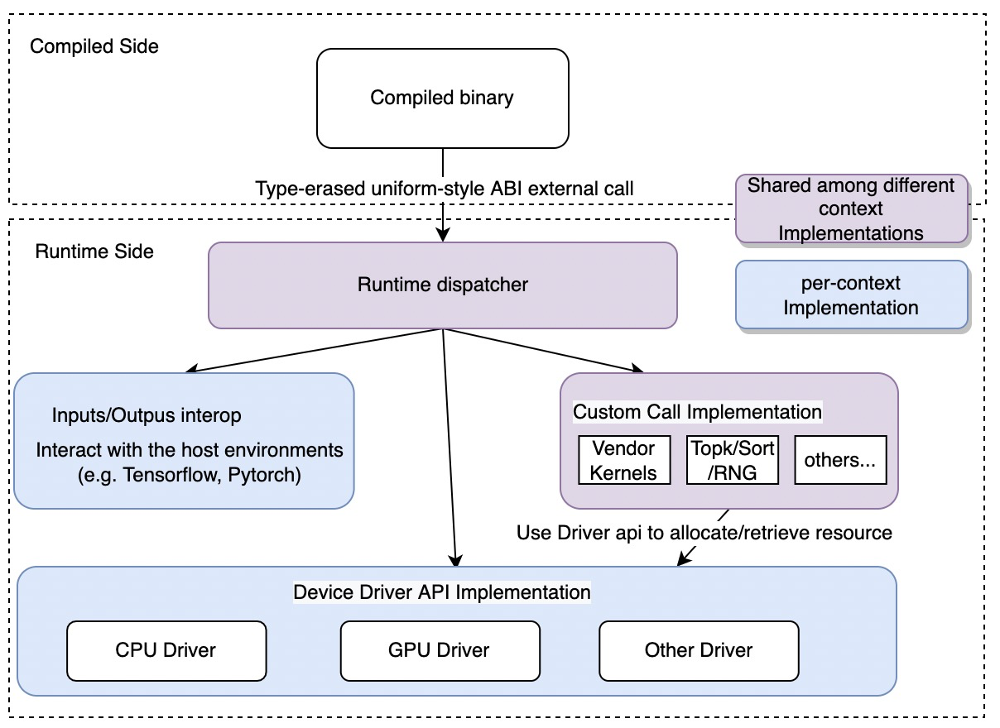

# Runtime Abstraction Layer Introduction

## Motivation

BladeDISC is an MHLO based e2e compiler with the consideration of both the
compiler and the associated runtime. For the runtime side, we have different
targeting environments (e.g. TensorFlow, PyTorch, or sometimes even a standalone
binary). To simplify the design of the compiler side, we leverage a Runtime
Abstraction Layer (RAL) to separate the compiler and runtime. Thus
the compiler side only needs to target RAL and relies on it to handle the
differences between different targeting environments.

Another function of RAL is to manage stateful resources. To this end, it
provides a context object and hides all stateful operations behind this context,
thus the compiler side itself doesn't need to care about the resource
initialization. For example, a kernel must be loaded before it can be launched
on GPU. However, the loading operation should only be taken once during the
whole lifetime of the context in order to achieve the best performance. Based on
the initialization-free interfaces (for example, load the kernel if it has not
been loaded and then launch) provided by RAL, the compiler side can focus on its
core optimization logic and lets the RAL manage the resource status.

## Design Overview

### From the Perspective of Compiler Side

In the compiler side, there is a set of transformation passes for RAL to make
sure the compiled binary is suitable for the RAL runtime.

#### Context Injection

As mentioned above, we prefer to simplify the design of the compiler side and
let it focus on its core optimization logic. Thus, RAL provides a context object
to hide all stateful operations behind the context. The context is passed as a
argument to the entry function of the compilation module and all RAL APIs
should always use the context as their first argument. RAL uses a context
injection pass to ensure this property. The pass rewrites the entry function and
all related functions to make sure their first argument is the context. To be
concrete, we create a custom dialect disc_ral using MLIR infra to model the RAL
runtime behavior. Inside the dialect, we define a custom type
disc_ral.RalExecutionContextType to represent the context type in the compiler
side. Under the hood, the disc_ral.RalExecutionContextType will be lowered to a
pointer type in LLVM IR.

#### Inputs/Outputs Binding

For the entry function, RAL also rewrites its inputs and outputs to make it
suitable to interact with different host environments. To be concrete, all the
original inputs and outputs of the entry function are received from and sent to
RAL through a sequence of RAL API calls correspondingly. The motivation behind
this is to hide the implementation details of the MemRef structure to make the
ABI clean and stable. Below is the example IR before and after the
transformation.

Original IR:

```
func @main(%arg0 : memref<?x?xf32>, %arg1 : memref<?x?xf32>) -> memref<?x?xf32> {
  %ret = alloc(...)
  use(%arg0, %arg1, %ret, ...)
  return %ret : memref<?x?xf32>
}
```

After conversion:

```
func @main(!disc_ral.context %ctx) {
  %arg0 = disc_ral.recv_input(%ctx, 0) // receive the first input
  %arg1 = disc_ral.recv_input(%ctx, 1) // receive the second input
  %ret = alloc(...)
  use(%arg0, %arg1, %ret, ...)
  disc_ral.send_output(%ctx, 0, %ret) // send the first outpt
}
```

As shown in the above example, the inputs (similar to the outputs) are received
from the RAL context one by one. We could choose to use one API call to receive
all inputs at the same time, which may also have lower runtime overhead in terms
of the number of RAL API calls. However, the current design lets the compiler
have the opportunity to adjust the placement of each recv_input and send_output
API to achieve partial execution of a compiled binary before all its inputs are
ready and sending some of the outputs to the context before all its outputs are
ready.

#### Uniformed type-erased external function call ABI
To make the compiled binary have stable and clean ABI, RAL provides a pass to
rewrite all RAL function calls to a uniformed type-erased style.

A RAL function is an ordinary c++ function that satisfies the following
requirements.
* The first argument of the function should be a pointer to the RAL context.
* RAL supports type bool, int8/16/32/64, half/float/double, MemRef struct, and
  ordinary pointer.
* The types of remaining arguments should be supported by RAL.
* The returning type should be supported by RAL.

For a given RAL function, it has an equivalent interface, namely a type-erased c
language interface. The main purpose of this kind of interface is used for
cross-language binding and linking.

Below is an example to demonstrate the c++ format and corresponding uniform
type-erased format.

```
// A RAL API to do GEMM operation, c++ format
void gemm(RalContext*, gpu_stream_handle*, MemRef<float, 2> lhs, MemRef<float, 2> rhs, MemRef<float, 2> out, bool lhs_transposed, bool rhs_transposed);

// ----======================================
// Uniform type-erased c format
//   the 1st arg is the ral context by design
//   the 2nd arg is the full name of a ral api
//   the 3rd arg is the pointer which points to the arguments of the ral api
//
//   RAL uses the following schema to get the full name of a ral function:
//
//     encoding = separator.join(target_name, device, inputs_encode,
//     outputs_encode)
//
//     separator = '___'
//
//     target_name: name of the external function to dispatch.
//
//     device: user defined string (e.g. cpu or gpu)
//
//     inputs_encode = type_separator.join([type_encoding for type in
//     input_types])
//
//     outputs_encode = type_separator.join([type_encoding for type
//     in output_types])
//
//     type_separator = '_'

// The dispatcher will dispatch to concret RAL function implementation according to the api_name
void ral_api_call(void* ctx, const char* api_name, void** args);
```

Furthermore, we also provide a registry mechanism to automatically convert a RAL
function from its c++ format to its uniform format. Below is an example.

```
// A RAL API to do GEMM operation, c++ format
template <typename T>
void gemm(RalContext*, gpu_stream_handle*, MemRef<T, 2> lhs, MemRef<T, 2> rhs, MemRef<T, 2> out, bool lhs_transposed, bool, rhs_transposed);

// ----====================================

// register a new RAL API using macro `TAO_RAL_API`.
//   Usage: TAO_RAL_API(api_prefix, device, api_function);
//   - generate a unique name based on the prefix provided and the types of inputs and outputs of the function.
//   - automatically provide a uniform interface wrapper
//   - register the wrapper function using the unique name generated.

// register ral_gemm with float type
TAO_RAL_API("ral_gemm", "cpu", gemm<float>)
// register ral_gemm with half type
TAO_RAL_API("ral_gemm", "gpu", gemm<half>)
```

Thus, based on the mechanism in the compiler side and the mechanism in the c++
side, users don't need to worry about the details of c interface implementation
and can use the c++ level API directly.

### From the Perspective of Runtime Side

#### Overview of the Runtime Side of RAL

The runtime side of the RAL can be divided into three major parts as shown in
the following .

* Interacting with the host environments (e.g. Tensorflow, PyTorch). This part
  usually includes i/o bindings and other bookkeeping stuff. We need different
  implementations of this part for different hosting environments.
* Providing an implementation of the initialization-free driver API for each kind
  of device. In RAL, each kind of device defines its own core set of driver
  APIs. The driver usually includes memory management, task launching, and
  synchronization. It's worth noting that we need different driver
  implementations for the same device type in different host environments. One
  rationale is that different host environments usually have different device
  abstraction layers, leading to different API styles and semantics. Another
  reason is that using the host environment native device resource access style
  could also minimize the overhead when crossing the host environment and RAL
  boundary.
* Providing an implementation of the custom kernel. Examples are vendor library
  kernel, RNG, TopK, or sort op. These kernels are usually not generated by
  BladeDISC and rely on some manually crafted implementations. It is worth
  noting that the custom kernel itself uses the RAL driver API to access device
  resources, and thus can be shared among different host environments since the
  RAL driver has already hidden the differences among different host
  environments.

#### RAL Context

We provide different RAL Context implementations for different target host
environments. The context implementation consists of the above three major
parts. Currently, we have TF context implementation, which is used to be
integrated with TensorFlow (both CPU & GPU), and base context implementation,
which is used to be integrated with Pytorch and sometimes the standalone binary.

#### RAL Execution Context

For a loaded compiled binary, we have one corresponding RAL context to manage
the stateful resources and some bookkeeping stuff.  The context lifetime is the
same as the loaded compiler binary. RAL execution context is a wrapper of RAL
context and is designed to do bookkeeping for a single execution of the compiled
binary. Whenever we call the compiled binary, we first create an execution
context from the RAL context and then feed the execution context instead of the
context to the entry function of the compiled binary. This design is more
friendly and efficient for multi-thread execution situations.
