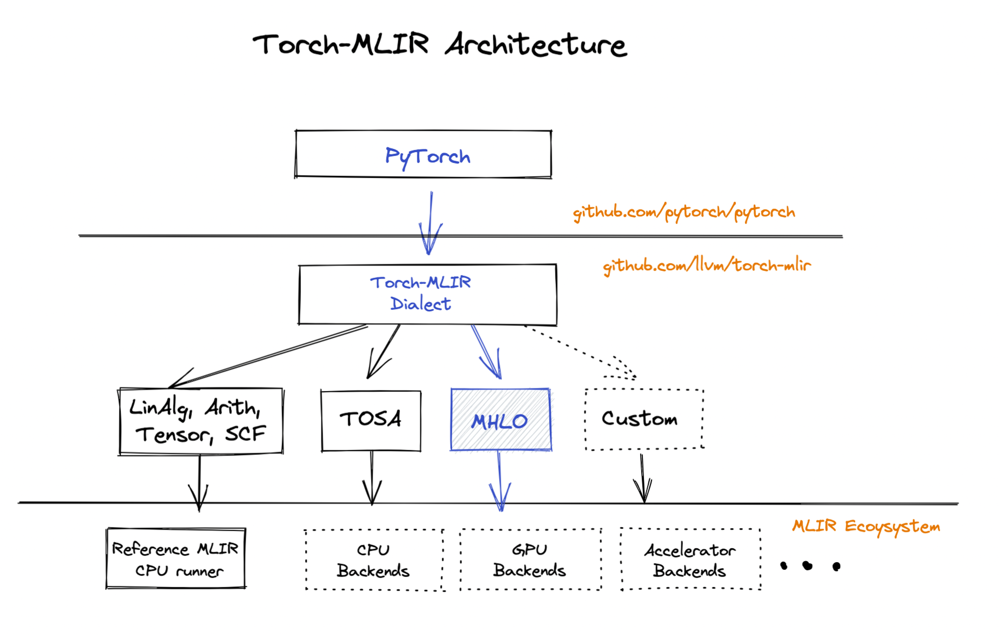

# How To Add a New Torch Operator



TorchBlade converts PyTorch workloads to MHLO based on [Torch-MLIR](https://github.com/llvm/torch-mlir/).
Then compile the MHLO modules via BladeDISC compiler.

The BladeDISC Dev Team is cooperating with the community to add Torch-To-Mhlo
conversion to Torch-MLIR, especially fully dynamic shape features.
See RFC: https://github.com/llvm/torch-mlir/issues/999.
We appeal to the community developers interested in joining.

## To the Developers of Torch-MLIR

TorchBlade Torch operator conversion will comply with Torch-MLIR generally.
Developers of this part are recommended to have a look at the following:

1. [Torch-MLIR Coding Style](https://github.com/llvm/torch-mlir/wiki/Coding-Style)
2. [Torch-MLIR Torch Ops E2E Implementation](https://github.com/llvm/torch-mlir/wiki/Torch-ops-E2E-implementation)
3. [Torch-MLIR Architecture](https://github.com/llvm/torch-mlir/blob/main/docs/architecture.md)

## To the Developers of BladeDISC

### Step 1: Add a New Torch Operator to Supported White List

TorchBlade will cluster supported operation regions into subgraphs and then convert subgraphs from TorchScript
into MHLO modules via Torch-MLIR; Finally, they will be compiled and executed by BladeDISC.

As shown in [`torch_mlir_op_filter.cpp:GetTorchMlirWhiteList()`](https://github.com/alibaba/BladeDISC/blob/main/pytorch_blade/pytorch_blade/compiler/mlir/converters/torch_mlir_op_filter.cpp#L39),
the operator name is required to be in the list so that TorchBlade will try to convert it as supported.

To the debug needs, one can use the environment variable `TORCH_MHLO_OP_WHITE_LIST` to specify some extra white list operators
without re-compilation. For example, `export TORCH_MHLO_OP_WHITE_LIST="aten::batch_norm_a;aten::activation_b;"` before a run.

You can find ATen native node schema definitions at
[ATen/native](https://github.com/pytorch/pytorch/tree/master/aten/src/ATen/native);
The TorchBlade also provides a tool function
[`node_schema_str`](https://github.com/alibaba/BladeDISC/blob/main/pytorch_blade/src/compiler/jit/tool_funcs.cpp#L110)
that returns the schema of the input node.

```python
import torch
import torch_blade.tools as tools

@torch.jit.script
def add(x, y):
    return x + y

print(add.graph)
for n in add.graph.nodes():
    print(tools.node_schema_str(n))
```

```text
graph(%x.1 : Tensor,
      %y.1 : Tensor):
  %4 : int = prim::Constant[value=1]()
  %5 : Tensor = aten::add(%x.1, %y.1, %4)
  return (%5)


aten::add.Tensor(Tensor self, Tensor other, *, Scalar alpha=1) -> (Tensor)
```

### Step 2: Add Shape Analysis for the Operator

Note that data types and shapes are critical to Deep Learning Compilers nowadays.
TorchBlade holds its shape analysis upon TorchScript; 

+ It focuses on rank and dynamic shape inferences
+ To support subgraph compilation clustering and cache, ranks, and data types are needed before conversion to Torch-MLIR

To avoid exceptions, TorchBlade will skip the [shape and type refinement passes](https://github.com/llvm/torch-mlir/blob/708fa346a6cffb9f1548730d77a19cc1c3d1991a/lib/Dialect/Torch/Transforms/Passes.cpp#L119-L128) from Torch-MLIR.

Please add type and shape analsyses when it's missing, see [`shape_analysis.cpp`](https://github.com/alibaba/BladeDISC/blob/main/pytorch_blade/pytorch_blade/compiler/jit/torch/shape_analysis.cpp).


### Step 3: Update Torch-MLIR ODS

It means that the Torch operator is missing from Torch-Dialect of Torch-MLIR.
if you found an exception raised because of "failed to legalize operation `torch.operator`".

You must add the new operator to Torch-Dialect, see [Torch-MLIR Update ODS](https://github.com/llvm/torch-mlir/wiki/Torch-ops-E2E-implementation#step-2-update-ods).


### Step 4: Torch Operator Lowering

There are 2 ways to add lowering:
+ Decompose a Torch operator into more primitive operators
  + [`DecomposeComplexOps`](https://github.com/llvm/torch-mlir/blob/main/lib/Dialect/Torch/Transforms/DecomposeComplexOps.cpp)
  + [`DiscDecomposeComplexOps`](https://github.com/alibaba/BladeDISC/blob/main/pytorch_blade/pytorch_blade/torch-mlir/lib/Dialect/TorchConversion/Transforms/DiscDecomposeComplexOps.cpp)
+ Convert a Torch operator into MHLO directly
  + [`TorchToMhlo`](https://github.com/llvm/torch-mlir/tree/708fa346a6cffb9f1548730d77a19cc1c3d1991a/lib/Conversion/TorchToMhlo)
  + [`DiscTorchToMhlo`](https://github.com/alibaba/BladeDISC/blob/main/pytorch_blade/pytorch_blade/torch-mlir/lib/Conversion/TorchToMhlo/DiscTorchToMhlo.cpp)

You can add BladeDISC special Torch operator lowerings to `DiscDecomposeComplexOps` and `DiscTorchToMhlo`.
In general, it's encouraged to try to add lowerings to the passes in Torch-MLIR.

Please reference to [Torch-MLIR Torch Ops Lowering](https://github.com/llvm/torch-mlir/wiki/Torch-ops-E2E-implementation#step-5-torch-ops-lowering) as well.

### Step 5: BladeDISC Codegen

In rare cases, BladeDISC will fail to generate high-performant executables for the input MHLO modules.
To fix them, You can deep dive into the BladeDISC code generation pass pipeline.
See [A Walkthough of the BladeDISC Pass Pipeline](https://github.com/alibaba/BladeDISC/blob/main/docs/developers/pass_pipeline.md)

Feel free to fire an issue to BladeDISC Dev Team if something blocks you: https://github.com/alibaba/BladeDISC/issues.

### Step 6: Add a Unit Test

End-to-End unit tests are required as well. Please refer to the unit tests in
`pytorch_blade/tests/disc`, an example is:

```python
class TestDiscActivation(DiscTestCase):
    def test_relu(self, activation_func):
        relu = torch.nn.ReLU()
        x = torch.randn([2, 4, 16, 16], device=self.device)
        self._test_cvt_to_disc(relu, (x,))

```
