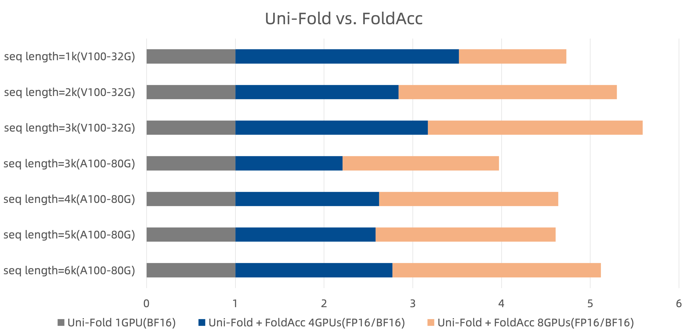
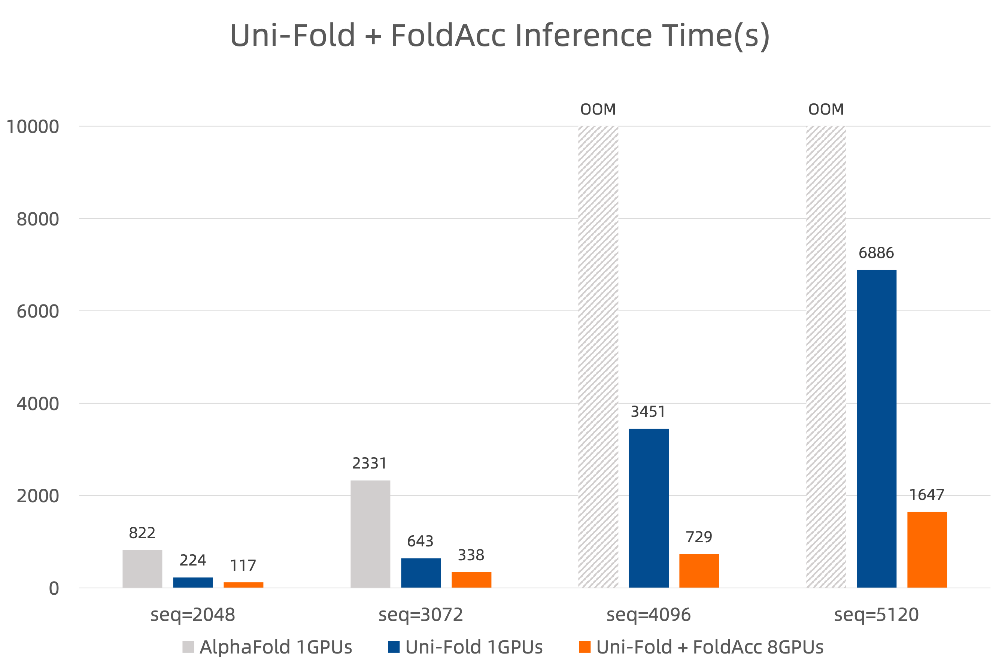

# DISC Optimization Example for PyTorch AlphaFold Model.

This repository provides a tool(FoldAcc) and scripts showing how to optimize a AlphaFold model for PyTorch with DISC/AMP(auto mix precision)/Tensor Parallel.
The AlphaFold model is constructed with [Uni-Fold](https://github.com/dptech-corp/Uni-Fold) or [OpenFold](https://github.com/aqlaboratory/openfold).

FoldAcc is an independent tool and maybe it will be moved out into a separate repository in the future.

## Prerequisite

### Installing BladeDISC

To build and install `torch_blade` package, please refer to
["Build BladeDISC from source"](https://github.com/alibaba/BladeDISC/blob/main/docs/build_from_source.md) and
["Install BladeDISC with Docker"](https://github.com/alibaba/BladeDISC/blob/main/docs/install_with_docker.md).

We recommend installing BladeDISC with Docker `bladedisc/bladedisc:latest-runtime-torch1.12.0-cu113`.

### Installing Uni-Fold/OpenFold

Please refer to [Uni-Fold](https://github.com/dptech-corp/Uni-Fold) to install UniFold.

Please refer to [OpenFold](https://github.com/aqlaboratory/openfold) to install OpenFold.

### Installing FoldAcc

You can run the following command to install foldacc tool:

```bash
cd FoldAcc && python3 setup.py install
```

## Inference

### Accelerate Uni-Fold Inference

You can run the example with the following command, the detail arguments are same as Uni-Fold:

```bash
torchrun --nproc_per_node=2 unifold_inference.py ...
```

### Accelerate OpenFold Inference

You can run the example with the following command, the detail arguments are same as OpenFold:

```bash
torchrun --nproc_per_node=2 openfold_inference.py ...
```

## Quickstart

We provide a FoldAcc tools to accelerate AlphaFold model.

To make users easier to use, FoldAcc provides simple Python API is as follows:

```bash
from foldacc.fold.unifold import optimize_unifold

# create AlphaFold model by Uni-Fold
from unifold.config import model_config
from unifold.modules.alphafold import AlphaFold

config = model_config(...)
model = AlphaFold(...)

# use optimize_unifold to accelerate model
with torch.no_grad():
    blade_model = optimize_unifold(
        model,                      # AlphaFold model.
        config,                     # AlphaFold config.
        enable_disc=True,           # whether use bladedisc (maybe spend two hours if open).
        enable_low_mem=False,       # whether use low memory optimize (for long sequence).
        enable_amp=True,            # whether use auto mix precision (only use for float16).
        enable_trace=True,          # whether convert model to torchscript.
        dtype=torch.half,           # model precision (support torch.float/torch.half/torch.bfloat16).
        device=0,                   # target device.
        save_dir=None,              # save directory of optimized model.
        load_dir=None               # load directory of optimized model.
    )

# do inference
...

```

## Performance results.

We evaluated the Uni-Fold optimized by FoldAcc on multimers.

<figure align="center">

<figcaption align = "center">
<b>
Fig.1 Uni-Fold optimized by FoldAcc performs better on multimers than the original Uni-Fold.
</b>
</figcaption>
</figure>


The detailed configuration is as follows:

|      Device      | enable_disc | enable_amp |  enable_trace  |  enable_low_mem  |      dtype      |
|------------------|-------------|------------|----------------|------------------|-----------------|
|  V100 (seq < 2k) |    True     |    True    |      True      |      False       |  torch.half     |
|  V100 (seq > 2k) |    False    |    False   |      False     |      True        |  torch.bfloat16 |
|  A100 (seq < 5k) |    False    |    False   |      True      |      False       |  torch.bfloat16 |
|  A100 (seq > 5k) |    False    |    False   |      False     |      True        |  torch.bfloat16 |

We also evaluated the fastest inference speed of each framework by searching best chunk_size.

<figure align="center">

<figcaption align = "center">
<b>
Fig.2 The fastest inference speed of different frameworks.
</b>
</figcaption>
</figure>

## Acknowledgement

FoldAcc refers to the following projects:

- [AlphaFold](https://github.com/deepmind/alphafold)
- [Uni-Fold](https://github.com/dptech-corp/Uni-Fold)
- [OpenFold](https://github.com/aqlaboratory/openfold)
- [FastFold](https://github.com/hpcaitech/FastFold)

Some codes are modified from above-referenced projects, we add BladeDISC copyright header just for CI linter requirements.