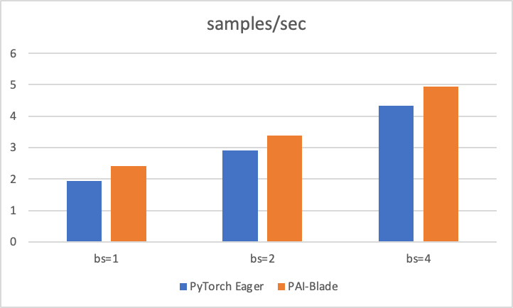

# StableDiffusion Examples

BladeDISC acceleartes StableDiffusion dreambooth fine-tune with 1.10X,
users can reproduce the results as the following steps, for more StableDiffusion examples,
please go to the official [diffusers repo](https://github.com/huggingface/diffusers/blob/main/examples).

## Dreambooth

### Steps

- step1:

    clone diffusers repo and install requirements in the BladeDISC runtime Docker image.

    ``` bash
    docker run --rm -it -v $PWD:/workspace -w /workspace bladedisc/bladedisc:latest-runtime-torch-pre-cu118 bash
    pip install diffusers==0.19.0
    ```

- step2: 

    launch the fine-tune job with TorchBlade accelerator.

    ``` bash
    cd examples/PyTorch/Train/Dynamo/StableDiffusion
    bash launch_dreambooth_train.sh
    ```
- step3:
    
    inference with trained model:

    ``` bash
    python inference.py
    ```
    
    you can check the generated image file `dog-bucket.png`.

### Benchmark


|  Backend   |       bs=1       |       bs=2       |       bs=4       |
| :--------: | :--------------: | :--------------: | :--------------: |
|   Eager    | 1.9303 samples/s | 2.9052 samples/s | 4.3350 samples/s |
| TorchBlade | 2.4889 samples/s | 3.4621 samples/s | 5.0066 samples/s |

TorchBlade can achieve up to 1.26X speedup with batchsize=1.
