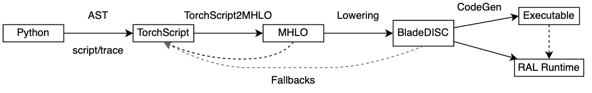

## Overview

The figure shows how a PyTorch nn.Module is compiled via BladeDISC. In short,
BladeDISC for PyTorch is a compiler to python subset language for deep learning.

A PyTorch nn.Module's forward mehtod is compiled to TorchScript by scripting or
tracing firstly. Later, some passes are runned to simplify the TorchScript graph
more closer to SSA(Static Single Assignment) Tensor computations. Then, some
subgraphs are converted to MHLO. Once BladeDISC get a MHLO module, it will
optimize and lower the module progressively to different backends.

BladeDISC for PyTorch only supports AOT compilation currently. While JIT's
roadmap should not differ too much. Please go to
[Pass Pipeline Walkthrough](../../docs/blade_disc_pass_pipeline_walkthrough.md)
for more details about the compilation phase after MHLO.

### 1. MLIR/MHLO

MHLO was chosen to be the tensor level "hub" IR between PyTorch and BladeDISC
compiler world, with the considerations:

- Dynamic shape support
- Control flow support
- Available and well established BladeDISC compiler
- Continuous improvements and updates from the MLIR/XLA community

### 2. Conversion & Lowering

During optimization and compilation, there are many conversions and lowering
among TorchScript and MHLO operators. We had to do the following things:

- Inline the functions and methods
- Freeze the parameters while reserving the required attributes
- Reduce and concrete the ranks and data types of the tensor and parameters
- Do constant folding and remove irrelevance or dead codes
- Do aliasing analysis and rewrite in-place operations to out-of-place
  corresponding versions

### 3. Converters

The IR converters are exactly the main mechanism that supports converting and
lowering from TorchScript to MHLO

- Query if the conversion of a graph node would succeed under a certain
  conversion context
- Build an MHLO module during converting TorchScript subgraph to MHLO

### 4. Clustering and fallback

TorchScript language is a subset of python for Deep Learning. There are many
primitive operators and data structures that are reflected by python. MHLO can
only support a subset of operators of TorchScript where tensors are values that
can't be modified. Those issues are called *language subset problems*. BladeDISC
addresses such problems with a clustering and fallback mechanism:

- Iteratively, clean pythonic IR's and reduce the TorchScript graph closer to
  computations with SSA semantics
- Collect supported candidate nodes to backend with the simplified graph
- Do clustering on the supported subset of nodes; The cluster had to be canceled
  if a cyclic was constructed
- Finally, fuse the clustered subgraph and lower it to the compiler backend; All
  the nodes outside the clusters are fallback to TorchScript.

### 5. Runtime(RAL, Runtime Abstraction Layer)

The runtime of our BladeDISC compiler, [more details](<>)

## Some additional views

### 1. Relations between aten::Tensor and mlir::Value(Tensor)

An `aten::Tensor` actually is a memory buffer that are shaped, so that it could
be viewed, modified in place and slices. However, `mlir::Value` could not be
modified. Any operations on `mlir::Value` would create new `mlir::Value`. The
memory buffer was neglected until graph was lowering to LMHLO.

### 2. Relations between Scalar and 0-rank Tensor

- A torch aten tensor can be viewed, reshaped, sliced and modified. But a torch
  Scalar can't.
- A 0-rank tensor in MHLO is equivalent to a scalar, and they could be converted
  to each other
- In BladeDISC, torch Scalar was converted to mlir standard dialect operator
  mlir::ConstantOp

### 3. How BladeDISC converts List\[Scalar\] and List\[Tensor\]

BladeDISC only converts those Lists of Scalars and Tensors that whose elements
could be analyzed statically at conversion time. Once the elements are known, we
could imitate the operations of List at conversion time, so that there is no
need to preserve List any more. Otherwise, BladeDISC would fallback the List
operations to TorchScript/PyTorch. So dose Dict.

## Difference to Torch-MLIR

Both [TorchMLIR](https://github.com/llvm/torch-mlir) and BladeDISC aims to
leverage MLIR as the middle layer mapping from PyTorch and progressively lower
down to different target hardwares.

The Torch-MLIR project aims to provide first class compiler support from the
PyTorch ecosystem to the MLIR ecosystem. Torch-MLIR centralize the conversion
between different frontends and backends. The `torch` dialect is automatically
generated from source-of-truth torch op registry, with only a few hand defined
operators for modeling program structures, such as class types. Also key `torch`
dialect transformations should be shared across different conversion paths.

BladeDISC mainly focuses on converting and lowering PyTorch operations to MHLO,
which is one of the roads from PyTorch to Backends. BladeDISC could benefit from
Torch-MLIR community. And we would like to commit our torch-to-mhlo converters
to Torch-MLIR.
